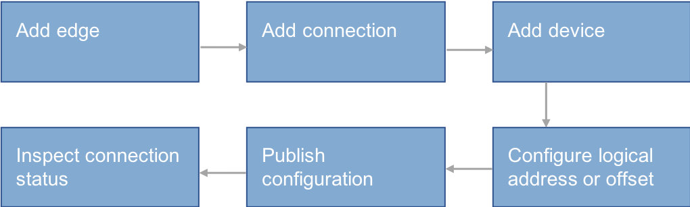

# Configuring edge connection

The device connection requires linking the device to the corresponding device template and configuring corresponding communication parameters. Check whether the connection mode is HTTP or TCP/IP. For the latter one, corresponding IP address and port number should be provided and number of linked devices should be listed.

After issuing the configuration to the edge end, if there is abnormal data, you can debug the connection to ensure that the data can be correctly sent to the cloud in a timely manner.

The procedure is shown as in the following figure:

Enter the **Edge Connection** menu to click the **Configeration Connection**, which is shown in the following figure:

## Before you start

An edge must have a legal serial number (SN) assigned by Envision to be recognized by EnOS™ Cloud. Obtain the SN from the Envision project manager.

## Step 1: Add edge

1. Click **Asset Management** > **Edge Connection** from the left navigation panel.
2. Click **Activate Edge** in the **Edge Connection** page and fill in edge name and serial number in the dialog edge that pops up, which is shown in the following figure:

Generally, one site only needs one edge. For large-sized site, as it contains lots of point numbers, but one edge can only be connected with limited point numbers, several edges need to be added. The system administrator should inform the user how many edges are required and how many devices can be connected to each edge based on the following data:
- The point number in the site
- The sampling frequency provided by the user.

## Step 2: Add connection

You can then click **Add connection** to add a connection in the edge. A connection is defined by its name, connection mode, and parameters based on the selected connection mode. The connection mode can be selected based on the type of the protocol and the type of the edge.

As shown in the following figure, edge is used as the TCP/IP client, so that the configured connection parameters are the IP address and port number of the server.

Generally, the edge will not be directly connected to the end server but connected through a gateway. Therefore, you need to obtain the gateway IP address and port number from the system administrator before you start mapping.

According to actual demand,several connections can be added under one edge.

**Note**:Select the type of connection according to the type of the protocol and the type of the edge.

## Step 3: Add device

After adding connection, add the device, which is shown in the following figure:

Click **Add Device** button under the link, open the page shown in the following figure. Select the device of same type to be added and select the device template to be linked and click Save.

  **Note**:select one kind of device first and select the device template for these devices.

## Step 4: Configure the logical address or offset

As pieces of device are connected to one link, the logical address and corresponding offset should be configured for each set of device. The configuration method depends on the adopted communication conventional procedure and setup. The device can be configured one by one or device connection information table can be exported for configuration before importing to the system to realize the batch configuration.

- Configure the device one by one

  Click the   icon after the device to edit the device.

- Batch configuration

  Click **Export** button under the link, download the connection information table for completion; click **Import** button to upload the information table, which is shown in the following figure:

  

  **Note**:The exported table supports the configuration of AI, DI, PI, AO, DO, PO offset. The basic configuration method is to use the short underlined connection, such as 0-50, which can be isolated from the English semicolon when there are multiple offsets, such as 0-50;1000-1000.

## Step 5: Publish configuration

After completing the above configurations, publish the configuration to the edge. Click **Publish** to publish the configuration to the corresponding edge, then you will see the status of the publish. After publishing, the configurations will take effect.

## Step 6: Test communication

After publishing configuration to the edge, you can inspect whether the configuration is correct or not through the communication indicator on the screen.
- When the device connects normally in the transmission layer (TCP/IP layer), the indicator is green.
- When the device connects abnormally, the indicator will turn red, which is as shown in the following figure:

There are several reasons for communication interruption:
- The configuration is not published.
- The configuration is wrong or the site end communication is abnormal.

Therefore, you need to perform further debugging to figure out the problem. EnOS™ provides the communication test function to help achieving the goal.

### Testing in batches

Click **Test** under the link and enter the batch test page of the link, which is shown in the following figure:

Click the upper **Start/Pause** button, to start or pause the communication test function.

Batch test: click the uppermost pull-down menu to convert the link and the connection parameters.

Batch test provides the following tabs to help you debug the connection failor.

#### Data

View all device under the link or screen the device to be viewed; view the update information of collection point data in the edge.

Support the number setting function of remote measuring and remote communication point at the same time. Click**add set** to set the value and click **send** to send the set value to the cloud.Click one to send one and it will not terminate the uploading of original data,which is equivalent to insertion of a value to the cloud.

#### Original message

View the original incoming and outgoing message and the message is reproducible

#### Log

In order to avoid information overflow, info-type log is hidden and only warn and error-type logs are displayed to help the user to judge the communication failure cause.

#### Console

Determine the common communication debugging orders, including basic ping test, local IP view, Telnet order and TCP connection view order.

The ping test requires filling in the required ping IP address in the input edge; Telnet test requires filling in IP and port number.

### Testing single device connection

Click **View** for the device to carry out communication test of the single device and view the data in the corresponding edge of the device. The function is consistent with the data function in the general batch test. Only single device is tested here.
