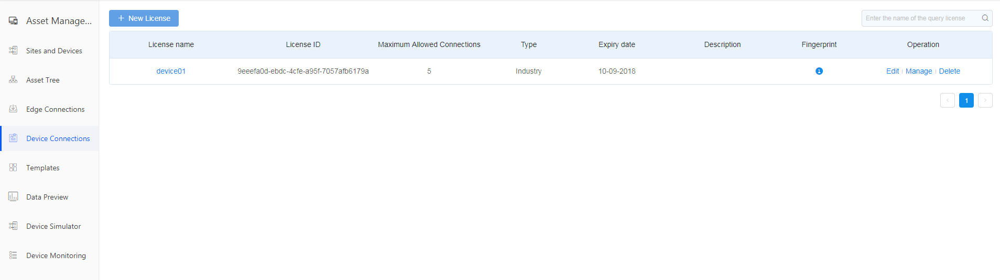
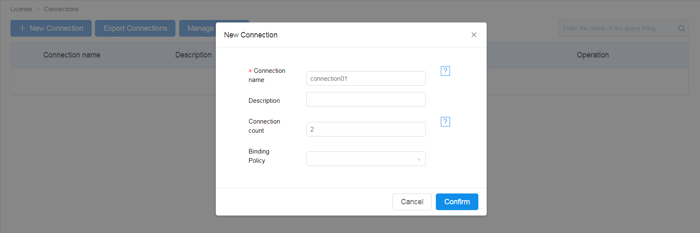

# Configuring direct device connections

To connect to the MQTT broker in the EnOS™ cloud, an MQTT client must have a license issued by the EnOS™. In this task, you'll create a license on EnOS™ and specify the MQTT connection settings.

## Procedure

1. Select **Device Connection** to enter the license page.

2. Click **New License**, fill in name, valid period, number of accessible devices, type and description information, and click **Confirm** to complete the license creation.   

    

3. Click License Name to enter the device list page.
    
4. Click **Connection** to enter the device list, click **New Connection** fill in device name and description and bind the policy.   


5. Click **Manage Policies** to enter the policy list, click **New policy,** fill in policy name and description and add a topic.

6. Click **Link test** to enter the connection test page.

   *Note: A published topic needs to have publication permission, and a subscribed topic needs to have subscription permission; if the publication is unresponsive or disconnected, check that the topic defined in the policy is authorized.*

7. Set each parameter for MQTT connection (see MQTT parameter list for details), and click **Connect** to establish connection between device and broker.

   Table 1. MQTT Parameter List

   <body>
<table border="1" cellspacing="0" cellpadding="0">
  <tr>
    <td valign="top"><strong>Parameter Name</strong></td>
    <td valign="top"><strong>Description</strong></td>
  </tr>
  <tr>
    <td valign="top">Host Name</td>
    <td valign="top">broker service address.</td>
  </tr>
  <tr>
    <td valign="top">Device Name</td>
    <td valign="top">Device name used to establish a connection, i.e. username.</td>
  </tr>
  <tr>
    <td valign="top">Device Key</td>
    <td valign="top">Key generated when a new device is created, used for authentication, i.e. password.</td>
  </tr>
  <tr>
    <td valign="top">User ID</td>
    <td valign="top">Client ID, a unique ID for each device. Establishing connections using the same id for different devices can cause other connections to be disconnected. A random string is generated by default and can be changed if you want to configure it.</td>
  </tr>
  <tr>
    <td valign="top">SSL</td>
    <td valign="top">SSL</td>
  </tr>
  <tr>
    <td valign="top">Keep Alive</td>
    <td valign="top">Connection duration, in seconds, default to 60 seconds, ranging from 0 to 3600.</td>
  </tr>
  <tr>
    <td valign="top">Clean Session</td>
    <td valign="top">Clear session   records.</td>
  </tr>
  <tr>
    <td valign="top">Last-Will Retain</td>
    <td valign="top">Last-will retain. If you check last-will retain, the last-will message will be kept and sent to the new subscription message when it is published.</td>
  </tr>
  <tr>
    <td valign="top">Last-Will Topic</td>
    <td valign="top">Last-will topic.</td>
  </tr>
  <tr>
    <td valign="top">Last-Will Qos</td>
    <td valign="top">Last-will QoS，the level of service used in the publication of a last-will message. O means once at most; 1 means once at least; 2 means a precise message.</td>
  </tr>
  <tr>
    <td valign="top">Last-Will Message</td>
    <td valign="top">Last-will message, IoT Hub will automatically issue this last-will message after the network connection is closed.</td>
  </tr>
</table>
</body>

8. Click the **Subscription Topic Button** to fill in the topic to be subscribed to

   See topics contained in the policy bound with the device

9. Fill in the topic and information published, click the **Publish** button to publish the message, and then receive the published message in the Message section.

    

   Wildcard Description:

   - “/”: Selimiter
   - “#”: Match a string or several strings separated by delimiters, such as topic/#, which can match: topic/ ,topic/test, topic/test/test, etc.
   - “+”: Match a string separated by delimiters, such as topic/+/test, which can match topic/test/test, topic/123/test, etc.

## Related Information

### Connection Mode of MQTT and its Port Number


- tcp: 11883
- ssl: 18883
- websocket: 11884
- ssl websocket: 18884

## JAVA Instance Code

```
public class MqttPub {
    private static final char[] PASSWD = **cNetty**.toCharArray();
    private static final String ALGORITHM = **SunX509**;
    private static final String jks = **cChat.jks**;

    private static SSLContext createContext() throws Exception {
        SSLContext context = SSLContext.getInstance(**TLS**);
        KeyStore ks = KeyStore.getInstance(**JKS**);

        ks.load(new FileInputStream(new File(jks)), PASSWD);
        TrustManagerFactory tmf = TrustManagerFactory.getInstance(ALGORITHM);
        tmf.init(ks);
        context.init(null, tmf.getTrustManagers(), null);
        return context;
    }

    public static void main(String[] args) throws Exception {
        final String broker = **ssl://eos-beta.envisioncn.com:18883**;

        new Thread() {
            @Override
            public void run() {
                try {
                    SSLContext ctx = createContext();
                    // broker means host name: “paho-java-client-3” means user ID
                    MqttClient sampleClient = new MqttClient(broker, **paho-java-client-3**, new MqttDefaultFilePersistence());
                    MqttConnectOptions connOpts = new MqttConnectOptions();
                    connOpts.setCleanSession(false);
                    // username means device name; password means device key
                    connOpts.setUserName(**GCP_China_01**);
                    connOpts.setPassword(**4ab11cbc99a398b344418228b9ee2d6489e6c2fb**.toCharArray());
                    connOpts.setSocketFactory(ctx.getSocketFactory());

                    sampleClient.connect(connOpts);

                    for (int i = 0; i < 10; i++) {
                        String msg = String
                                .format(**{\**object\**: \**1958f6c92bc00000\**, \**timestamp\**:%d, \**METER3X.UA\**:\**50.0\**, \**DEVICE_CONN\**:\**%d\**}**,
                                        System.currentTimeMillis(), i);
                        MqttMessage message = new MqttMessage(msg.getBytes());
                        message.setQos(1);
                        // message.setRetained(true);
                        sampleClient.publish(**Meter**, message);
                    }
                } catch (Exception me) {
                    me.printStackTrace();
                }
            }

        }.start();

        TimeUnit.SECONDS.sleep(2);
    }
}
```

The example code is based on an open source paho mqtt client, and the corresponding Maven dependency is

```
<dependency>
    <groupId>org.eclipse.paho</groupId>
    <artifactId>org.eclipse.paho.client.mqttv3</artifactId>
    <version>1.0.2</version>
</dependency>
```

The instance above is based on SSL for secure connections. If you need this certificate file (cChat.jks), please contact our platform.
