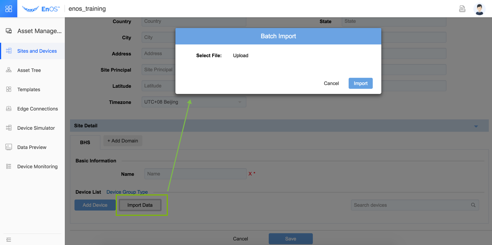

# Creating sites and devices

As shown in the figure, building new sites includes three parts:
1. Building new physical site
2. Building new logical site and adding device in the logical site.
3. Adding device, supports two modes:
   - adding one by one
   - adding in batch

## Step 1: Create a new physical site

Enter into **Asset Management > Site and Devices** menu in the left navigation bar and click **New Site** button to pop up the page of building physical site and enter into the information editing page of the physical site, which is shown as follows:

## Step 2: Create new logical site

It needs to build new logical site in a certain domain under the physical site. In the information editing page of the physical site, click **Add Domain** button to select the logical site in the required domain and pop up the information editing bar of logical site; click **Expand** button in the basic information page of the logical site to expand the information editing bar of the logical site and fill in the complete site information.

Moreover, several new logical sites can be built under one physical site (regardless of the sites in the same domain or different domains, based on the business requirements).

## Step 3: Add devices

### Option 1: Add one by one

The device contained in the site can be added under the logical site. Adding device one by one or batch by batch is supported. Adding device one by one is suitable for the site containing few device or the scenario requiring adding several device temporarily.

Click **Add Device** button and pop up the dialog edge for the user to select the device type. After selecting the device type, expand the device attribute editing page for the user to fill in the device attribute.

### Option 2: Add device in batches

Adding device batch by batch is mainly suitable for the scenarios that a large number of device is contained in the site. The user can edit the device attribute information of same device type in advance and import the device batch by batch at once.

*Note:The user need to add a new device manually after creating a new site, and save the configuration successfully, the user can add device-batch by batch.*

Click **Export Device Template** button and select the device type in the dialog edge that pops up and download the CSV-format data table file of the corresponding type of device information template.

Fill in the complete device information in the device information template table and click **Import data** to import the table to the system to realize the batch import of same type of device data, which is shown in the following figure:

**Note**: After editing, click **Save** button to give effect to the editing operation.
