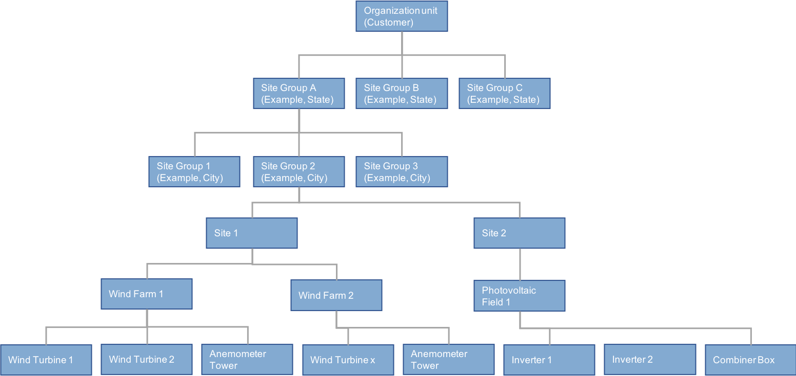

Asset management
==========================

Asset management overview
----------------------------

In EnOS™, an *asset* is a device or an organization entity where the
asset belongs to. In practice, devices are typically organized hierarchically.
The hierarchical structure is an *asset tree*, and each node in the tree is an asset.

The EnOS™ platform allows you to build your asset tree based on certain rules where a child asset node belongs to a parent asset node in terms of certain criteria.

The EnOS™ platform provides the following types of asset nodes to help you
organize your assets:

- **Site**: indicates a physical site where your devices reside. Site is the default node in an asset tree. A site can have multiple subordinate *projects*.

- **Site group**: a self-defined node in the asset tree that can have multiple subordinate sites. For example, a city or state where the sites reside. You can define multiple layers of site groups according to your needs.

- **Customer**: the root node of an asset tree. A customer can have multiple subordinate sites, multiple site groups, or multiple level of site groups.

- **Project**: a logical organization entity, which indicates a subset of a site. The subset of the site can be of a certain *domain*.

- **Domain**: the common attribute that describes the devices in a project or in a device group of a project. For example, when the domain is wind farm, the devices in the project or device group are wind mills.

- **Device group**: a logical organization entity, which indicates a subset of a project, this node is optional in an asset.

- **Device**: a device of a certain model that belongs to a certain domain.

For example, a turbine device in the wind farm domain.

Among the types of asset nodes, projects and devices are created from *models*. A model is the abstraction of the assets that share the same asset type. EnOS™ provides *predefined models* for a lot of common devices, you can also define *customized model* for your own devices. For more information, see `Device modelling <../device_modelling/model_overview>`__ .

When an asset is created from a model, EnOS™ provides the following types of data
for the asset:

- Attribute
- Measuring point
- Calculation logic

For other types of asset node, the asset configuration usually contains only simple information like name and type.

The following figure shows an example asset tree.

.. toctree::
   :maxdepth: 1
   :caption: How-To's

   creating_sites_devices
   creating_asset_tree
   creating_templates
   configuring_mqtt_connection
   configuring_edge_connection
   simulating_device
