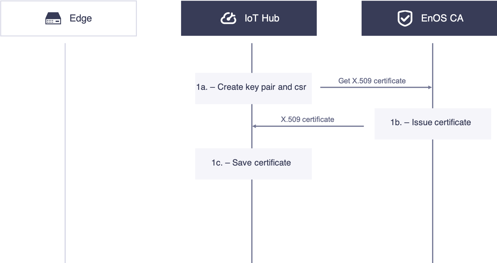
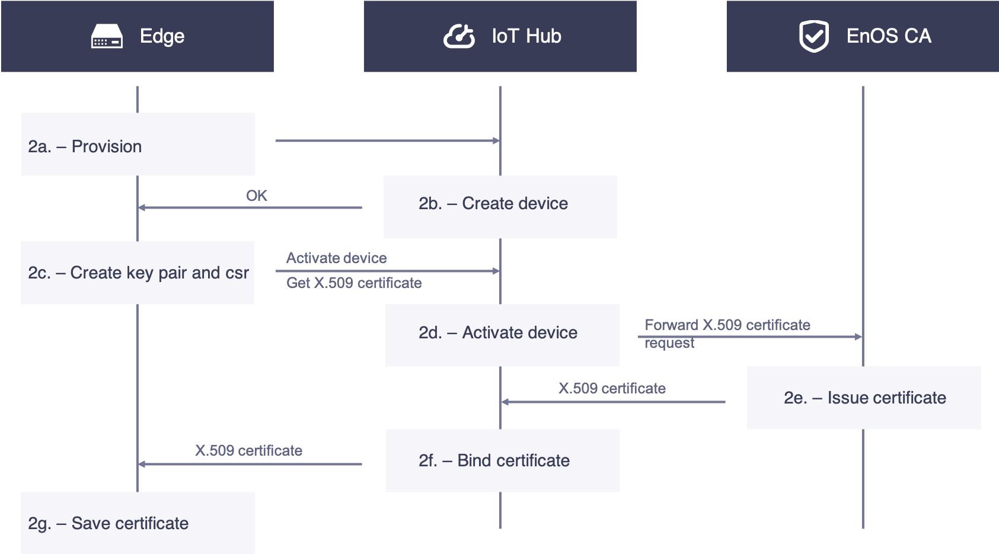
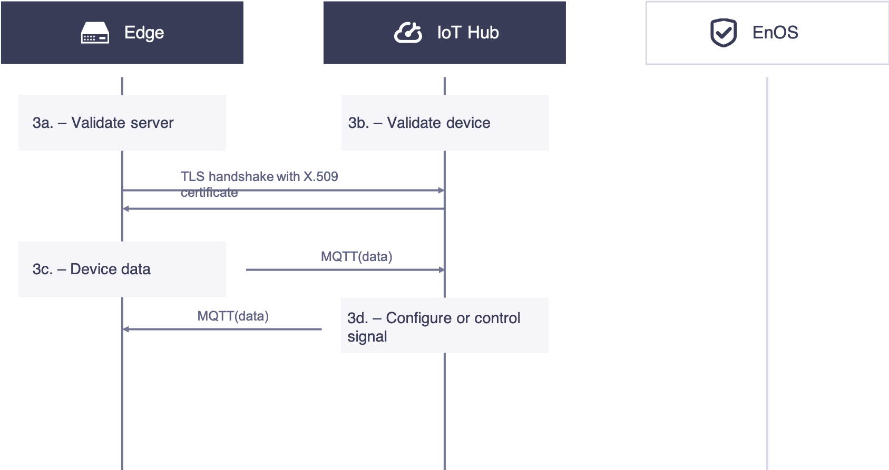
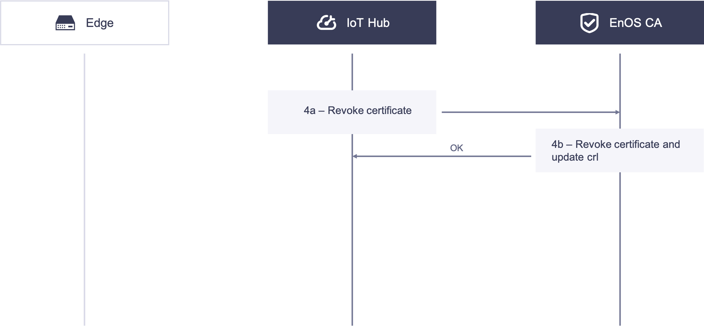

# Certificate-based Two-way Authentication

Security is critical in an IoT system. When certificate authentication is enabled in the product configuration，EnOS enforces the following security schemes to secure the connection between the EnOS Edge and EnOS IoT Hub:

- The communications between the EnOS Edge and EnOS IoT Hub are enfored to use certificate-based bi-directional authentication.
- Support for RSA algorithm to verify signature, with enforcement for 2048 bits.

## Setup Phase

The following diagram illustrates the process of secure communication between the edge and IoT Hub based on X.509 certificates:

### 1. IoT Hub Acquires X.509 Certificate

1a. The IoT Hub creates key pairs and CSR locally, acquires the X.509 certificate with the CSR by using the X.509 Certificate Service API.

1b. The EnOS CA issues the X.509 certificate and sends the certificate to the IoT Hub.

1c. The IoT Hub receives and stores the X.509 certificate.

### 2. Edge Acquires X.509 Certificate

2a. Before leaving the factory, the Edge devices are pre-burned with a product certificate (`ProductKey` and `ProductSecret`) as well as a device serial number (SN). When powered on and connected to the network, the device will report its product certificate and serial number to the cloud for dynamic activation. The cloud will return the `DeviceSecret` to the Edge if the authentication is successful.

2b. On the IoT Hub, the serial number of the Edge device is used as the `DeviceKey` to pre-register the Edge device. The device can be registered either via the EnOS Console or by calling the REST API.

2c. The Edge receives the responses from the IoT Hub, creates key pairs and CSR, and calls the API to get its X.509 certificate. Meanwhile, the device trigraph is used to log the device in to the cloud, and the device will be activated upon its first login.

2d. The IoT Hub receives the CSR from the edge, after verifing its identity, forward the CSR to the EnOS CA.

2e. The EnOS CA receives the CSR, issues the edge certificate and responds to the IoT Hub.

2f. The IoT Hub receives the issued X.509 certificate, binds it with the device id, and then sends the edge certificate to the edge.

2g.The edge receives the edge certificate, saves them securely in the local repository, for example, the Trusted Platform Module (TPM).

## Communication Phase

The diagram below illustrates the certificate-basd authentication process:

### 3. Edge Communicates with the IoT Hub through Certificate-based Bi-directional Authentication

3a. The edge validates the certificate of the IoT Hub.

3b. The IoT Hub validates the certificate of the edge.

When the TLS handshake in step 3a and 3b succeeds, the TLS connection is established between the edge and the IoT Hub.

3c. The edge transmits device telemetry through MQTT over the TLS connection.

3d. The IoT Hub transmits configurations and control signals through MQTT over the TLS connection.

## Revocation Phase

Under some circumstances, user needs to revoke the X.509 certificate of the edge. The following diagram illustrates the revocation process.

### 4. The IoT Hub Revokes the X.509 Certificate of the Edge

4a. The IoT Hub calls the revocation API to revoke the X.509 certificate with the serial number of the certificate.

4b. The EnOS CA receives the request from the IoT Hub, verifies the identity, revokes the certificate, and updates the CRL.

## Edge Security Best Practices

In the certificate-based security connection, consider the following best practices to secure the edge:

- Create the private key for the edge and keep it secret in a storage such as TPM.
- Use TLS 1.2 when communicating with the IoT Hub, and verify that the server certificate is valid.
- Each edge must have a unique public/private key pair.
- The key pair used to be authenticated by IoT Hub should not be used for other purposes or communications through other protocols.
- The key must be revoked when the edge is reset.
- When your edge runs on an operating system, make sure your operating system is secured through certain machanisms, for example, firewall.
- Ensure that you have a way to update root CA certificates and CRL.
- Ensure that the clock on the edge is not tampered with.
