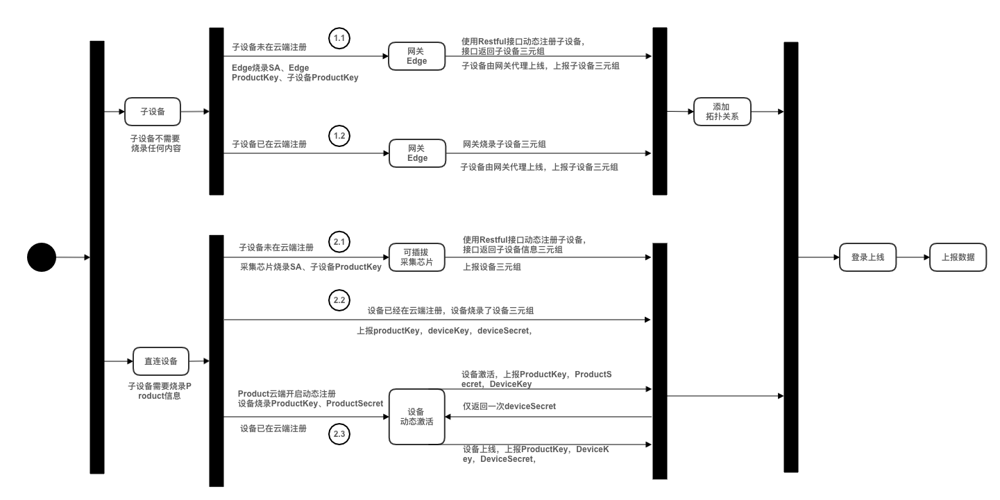

# 设备接入方案

在EnOS平台中，无论是edge设备，还是直连IoT Hub的设备，都必须满足EnOS的统一鉴权、上线步骤，才能发送数据至平台。

## 概念

设备与EnOS IoT Hub连接主要涉及以下操作及状态：

- **注册**
  就是在云端创建一个设备，可以通过Portal方式在界面上创建，也可以通过调用Restful接口方式创建。

- **登录**
  设备上送数据之前，必须首先登录成功，然后才可以发送数据。设备登录需要使用设备三元组鉴权。

- **激活**
  设备的第一次登录成功，会激活设备，将设备从**未激活**状态，更新为**已激活**状态。**已激活**状态包含**在线**和**离线**两个子状态，在EnOS控制台中会使用**在线**和**离线**两个子状态来代替显示**已激活**状态。

## 设备激活方式和设备状态

在EnOS平台初次创建的设备，默认是处于启用但未激活的状态，等待设备激活。设备激活分为_动态激活_和_静态激活_。
- **动态激活**：动态激活的过程如下：
  1. 设备第一次尝试连接时携带`ProductKey`，`ProductSecret`，`DeviceKey`来请求激活，鉴权通过以后，返回`DeviceSecret`给设备。
  2. 设备通过`ProductKey`，`DeviceKey`，`DeviceSecret`尝试登录。
  3. 设备登录成功以后，设备状态从**未激活**变成**在线**状态。此时设备可以上送数据，如果一段时间内不上送数据，设备状态变成**离线**。

  如需采用动态激活方式，你需要在Product配置中开启**动态激活**。

- **静态激活**：静态激活的过程如下：
  1. 设备登录请求携带`ProductKey`，`DeviceKey`，`DeviceSecret`。
  2. 设备登录成功以后，设备状态从**未激活**变成**在线**状态。此时设备可以上送数据，如果一段时间内不上送数据，设备状态变成**离线**。

如果发现设备异常，或者不希望接受该设备的数据，可以认为将其置为**禁用**，此时设备将自动下线，处于**离线**状态。

设备整体的状态可以分为操作状态（Operational state）、激活状态（Activation state）、连接状态（communication state）三个维度，如下表所示：

<table>
   <tr>
     <th>操作状态</th>
     <th>激活状态</th>
     <th>连接状态</th>
   </tr>
   <tr>
     <td>禁用 Disable</td>
     <td></td>
     <td>离线 Offline</td>
   </tr>
   <tr>
     <td>启用 Enable</td>
     <td>未激活 Inactivated</td>
     <td></td>
   </tr>
   <tr>
     <td></td>
     <td>已激活 Activated</td>
     <td>在线 Online</td>
   </tr>
   <tr>
     <td></td>
     <td></td>
     <td>离线 Offline</td>
   </tr>
</table>

## 接入场景

万物互联，前提是物具有被连接的能力，主要体现在两方面：
- 具有联网能力
- 支持烧录固件并运行连接程序

现实世界中的设备按照以上属性主要分成两类：
- 支持烧录固件，并通过Wifi、GPRS、3G、4G信号直连物联网平台。
- 不支持烧录固件，也不具备Wifi、3G、4G联网的能力。该场景下，需要通过edge来采集设备的数据，设备经由edge网关代理连接物联网平台。edge需要支持固件烧录和联网的能力。

### 设备直连场景

设备可直接与云端连接，常见的设备有：
- 带智能采集棒的设备，例如户用逆变器，户用储能电池
- 智能家居设备，例如监控摄像头，智能温湿度计

### 网关代理连接场景
设备需要网关代理才能与云端连接，常见的设备有：
- 分布式逆变器，网关直采多台逆变器，然后数据上送云端。
  

- SCADA，SCADA与风机直连，采集风机数据，网关与SCADA连接，网关采集SCADA数据，然后将数据发送至云端对应的风机设备。
  

## 安全认证机制

安全认证方式有两种：
- 基于密钥的单项认证：单项认证，安全性弱，为系统默认认证方式。
- 基于证书的双向认证：双向认证，安全性高，需要用户主动开启。

有关设备接入安全认证机制的更多信息，参考[设备认证机制](deviceconnection_authentication).

## 信息流

下图描绘了不同接入方式和激活方式选择方案的信息流：

<table>
   <tr>
     <th>场景编号</th>
     <th>连接方式</th>
     <th>激活方式</th>
     <th>是否使用SA</th>

   </tr>
   <tr>
     <td>1.1</td>
     <td>通过网关连接</td>
     <td>设备密钥静态激活</td>
     <td>是</td>

   </tr>
   <tr>
     <td>1.2</td>
     <td>通过网关连接</td>
     <td>设备密钥静态激活</td>
     <td>否</td>

   </tr>
   <tr>
     <td>2.1</td>
     <td>直连</td>
     <td>设备密钥静态激活</td>
     <td>是</td>

   </tr>
   <tr>
     <td>2.1</td>
     <td>直连</td>
     <td>设备密钥静态激活</td>
     <td>否</td>

   </tr>
   <tr>
     <td>2.3</td>
     <td>直连</td>
     <td>产品密钥动态激活</td>
     <td>否</td>
   </tr>
 </table>

## 场景示例

以下为部分上述接入方案的场景示例。

### 场景1.1：接入子设备未注册，通过Edge动态注册

1. Edge开发者，通过EnOS Console在EnOS Cloud注册一个Edge应用并获得该应用的服务账号（SA），即`accessKey`和`accessSecret`。

2. 物联网实施人员需要登录EnOS Console，在客户Organization下进行如下配置：
  - 创建Edge产品，并注册Edge设备，获得Edge设备三元组。
  - 创建Edge待接入设备的产品，获得`productkey`。

3. Edge出厂需要烧录以下凭据信息：
  - Edge应用的SA，以获得调用EnOS API的权限。
  - 由EnOS Cloud颁发的Edge设备三元组。
  - Edge待接入设备所属的产品`productkey`，以及设备所属Organization的标识，即`orgId`。

4. EnOS Cloud对edge调用Restful接口进行如下鉴权：
  - Edge基于SA获得调用EnOS API的权限。如果服务账号不对，则无法调用EnOS API，鉴权失败。
  - EnOS Cloud基于IAM校验edge连接请求中携带的orgId和SA参数，验证orgId所对应的Organization是否注册了Edge应用。如果没有注册Edge App，鉴权失败。
  - EnOS Cloud校验请求参数orgId与`productkey`的归属关系。如果`productkey`对应的产品不属于orgId对应的Organization，校验不通过。

5. EnOS Cloud对edge设备进行身份认证
  - Edge默认启用基于密钥的单项认证，Edge携带三元组连接云端，云端对edge三元组进行认证，认证通过以后edge设备登录。
  - Edge的第一次登录会同时激活edge设备，将其状态从**未激活**更新为**在线**状态。

6. 如果启用了基于证书的双向认证，证书的生成与分发过程如下：
    - Edge配置中心向EnOS IoT Hub发起证书请求，请求中携带证书请求文件。
    - EnOS IoT Hub代理将请求转发给EnOS Certificate Service。
    - Certificate Service产生证书，并返回给IoT Hub。
    - IoT Hub记录Edge关联的证书，并将Edge证书返回给Edge。

7. 物联网实施人员在EnOS Edge配置中心配置需要通过edge接入EnOS Cloud的子设备（如逆变器，风机，储能设备等），子设备注册有以下两种方式：
    - 动态注册：在edge配置中心直接创建要接入的设备，配置中心调用IoT Hub的REST API在EnOS Cloud中创建设备。
    - 静态注册：在EnOS Console中创建要接入设备，然后在edge配置中心进行绑定。由edge代理子设备连接至EnOS Cloud。

8. 设备数据传输
  - Edge与IoT Hub直接连接，子设备由edge代理连接至EnOS IoT Hub。
  - Edge与与IoT Hub之间的数据传输使用MQTT协议。
  - 如果启用基于证书的双向认证机制，edge与IoT Hub之间的数据传输内容将被证书加密。

### 场景1.2：接入子设备已注册，设备三元组已保存在Edge

原理与1.1是一样的，只是1.1当中edge烧录了SA，具备调用EnOS API的权限，所以可以通过API创建子设备。而在1.2场景当中，你需要事先在云端注册子设备，获取子设备三元组信息，并提前将子设备三元组信息烧录到edge中。在edge配置中心进行设备连接配置的时候，需要将接入设备与预先烧录的子设备三元组绑定。

1.2场景的配置复杂度要大于1.1的场景，1.1灵活性更好，但是1.2的安全性更高。从便捷的角度，可以考虑使用1.1场景。

### 场景2.1：接入设备未注册，通过可插拔采集信息动态注册
该以户用光伏逆变器为例进行说明。

户用光伏逆变器不支持烧录，常规场景需要使用采集棒进行数据采集并转发至云端。考虑采集棒只采集一台逆变器的数据，因此可以将逆变器和采集棒整体视为一个智能设备，采集棒支持烧录，所以可以看做逆变器和采集棒作为一个整体设备支持烧录。

1. 在云端创建逆变器产品（在客户Organization下创建，而非在开发者Organization下创建）。

2. 采集棒开发者在开发者OU下创建采集棒应用，获得采集棒应用的SA，`accesskey`和`accesssecret`。

3. 采集棒开发者对采集棒进行出厂配置，烧录以下凭证信息：
  - 烧录采集棒App的SA
  - 烧录逆变器`productKey`
  - 烧录`productKey`所属的`orgId`

4. 物联网实施人员进行现场施工安装，将采集棒安装在逆变器上，将设备上电和联网。设备联网后将发生以下动作：
  - 采集棒采集逆变器序列号，将序列号作为`deviceKey`，凭借SA调用REST API接口，通过`productKey`，`deviceKey`(序列号)，`orgId`动态创建设备，并获取设备的`deviceSecret`。
  - 采集棒记录`deviceSecret`，自动烧录到设备的固件当中。
  - 采集棒采集逆变器数据，使用`productKey`，`deviceKey`，`deviceSecret`去连接云端，鉴权通过，设备上线，然后发送数据。

### 场景2.2：接入设备已注册，设备出厂烧录自身的三元组
该场景要求设备出厂的时候就需要烧录在云端注册设备得到的设备三元组，这种场景对于烧录要求较高，安全性最高，但是可操作性较低。

### 场景2.3：接入设备已注册，批量设备烧录相同的Product信息
针对2.2场景可操作性较低的情况，增加了2.3场景。即
1. 每个设备出厂批量烧录相同的产品证书（即`productKey`和`productSecret`）。
2. 设备注册可以与设备厂商的设备管理系统进行集成，每发货一批次设备，客户设备管理系统可以通过调用REST API批量注册设备。
3. 当设备发往现场、上电、联网以后可以自动与云端进行连接。
