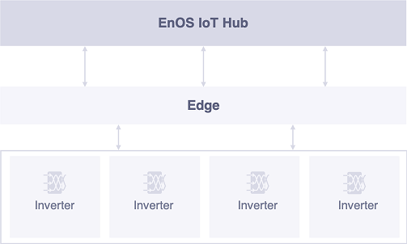
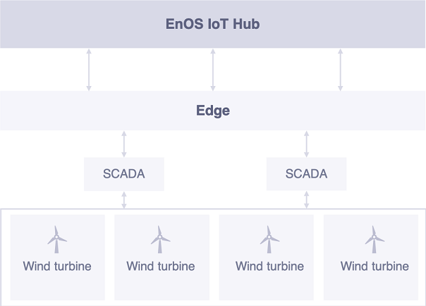
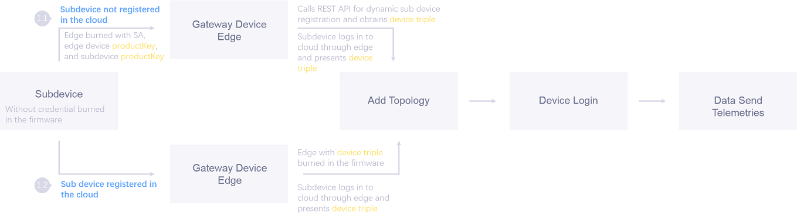
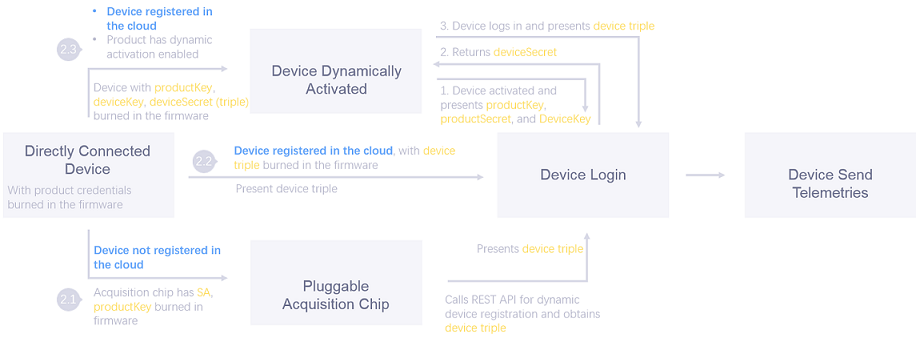

# Device Connection Schemes

All edge devices and directly connected devices must meet unified authentication and login procedure to be able to send telemetry into the EnOS Cloud.

EnOS mainly provides the following connection schemes:

- The device is directly connected into and communicate with the IoT Hub without using gateway devices (edge gateways, in our case) to complete authentication and data transmission. The device connected via this solution is called _directly connected device_.

- The device is connected to the EnOS IoT Hub via edge. The device connected via this solution is called _sub device_. The gateway serves as a proxy of the sub devices to help them complete operations such as authentication, login, and data transmission.

## Choosing Connection Schemes

The connection scheme is usually selected according to the hardware capabilities of the device and the security requirements for the device connection.

To be connected into the internet of things, an object must be able to be connected, that is, it should at least meet the following requirements:
- Can be connected into the network
- Supports burning of firmware and running of connection program

According to the above attributes, real-world devices can be divided into two major categories:
- Those support firmware burning, as well as direct connection to the IoT platform via Wi-Fi, GPRS, 3G, or 4G signals.
- Those do not support firmware burning, and are lack of the ability to connect via Wi-Fi, 3G, or 4G. In this scenario, data of these devices need to be collected by an edge gateway, and the devices are connected to the IoT platform through the edge gateway. Edge needs to support firmware burning and networking.

### Scenario of Direct Device Connection

The devices can be connected directly to the cloud. Some common devices include:
- Devices with smart acquisition rod, such as household inverters, and household energy storage batteries.
- Smart home devices, such as surveillance cameras, and smart thermometers and hygrometers.

### Scenario of Gateway Proxy Connection
The devices need a gateway proxy to connect to the cloud. Some common devices include:
- Distributed inverters: the gateway collects data directly from multiple inverters and then sends the data to the cloud.

  

- SCADA: the SCADA is connected directly to the wind turbines and collects the data; the gateway is connected to the SCADA to collect its data, and then sends the data to the cloud.

  

## Security Authentication Options

The EnOS IoT Hub supports two security authentication methods:
- Secret-based one-way authentication: one-way authentication, relatively weak security, enforced by the system by default.
- Certificate-based two-way authentication: two-way authentication with high security, enabled actively by the user.

For more information about the authentication mechanism for device connection security, see [Device Authentication Mechanism](deviceconnection_authentication).

## Message Flow

<table>
   <tr>
     <th>Scenario Number</th>
     <th>Connection Scheme</th>
     <th>Activation Mode</th>
     <th>Whether SA is Used</th>

   </tr>
   <tr>
     <td>1.1</td>
     <td>Connect via Gateway</td>
     <td>Static Activation via Device Secret</td>
     <td>Yes</td>

   </tr>
   <tr>
     <td>1.2</td>
     <td>Connect via Gateway</td>
     <td>Static Activation via Device Secret</td>
     <td>No</td>

   </tr>
   <tr>
     <td>2.1</td>
     <td>Direct Connection</td>
     <td>Static Activation via Device Secret</td>
     <td>Yes</td>

   </tr>
   <tr>
     <td>2.2</td>
     <td>Direct Connection</td>
     <td>Static Activation via Device Secret</td>
     <td>No</td>
   </tr>
   <tr>
     <td>2.3</td>
     <td>Direct Connection</td>
     <td>Dynamic Activation via Product Secret</td>
     <td>No</td>
   </tr>
 </table>

The message flow of different connection and activation methods are illustrated in the following sections:

### Connect via Gateway

The following figure illustrates the message flow of connection scenarios 1.1 and 1.2.

#### Scenario 1.1: The connected sub-device is not registered and is dynamically registered through the edge

1. In the EnOS Console, the edge developer registers an Edge application in the EnOS Cloud, and obtains the service account (SA) of the application: the `accessKey` and `accessSecret`.

2. The IoT engineer logs in to the EnOS Console and performs the following configurations in the client's organization:
   - Create an edge product and registers the edge device instance to obtain the edge device triple.
   - Create product for the sub-devices to be connected through the edge and obtain the `productkey`.

3. Burn the following credential information into the edge firmware during manufacturing:
   - The SA of the edge application, which will be used for obtaining access to the EnOS API.
   - The edge device triple issued by the EnOS Cloud.
   - The `productkey` of the sub-device to be connected through the edge, and the identifier (`orgId`) of the organization that the device belongs to.

4. The EnOS Cloud performs the following authentication procedure when the edge device calls the REST APIs:
   - The edge carries the SA to gain access to the EnOS API. If the service account is incorrect, the edge will not be able to call the EnOS API and the authentication will fail.
   - The EnOS Cloud, based on the access policies defined in IAM, verifies the `orgId` and `SA` parameters carried in the edge connection request, and verifies whether the corresponding organization identified by `orgId` has registered the edge application. If the edge application is not registered in the organization, the authentication will fail.
   - The EnOS Cloud verifies the attribution between the two request parameters `orgId` and `productkey`. If the product corresponding to the `productkey` does not belong to the organization identified by `orgId`, the verification will fail.

5. The EnOS Cloud performs authentication against the edge device
   - By default, the edge enables the secret-based one-way authentication. The edge carries the device triple and connects to the cloud, where authentication will be performed based on the edge device triple, the device is then allowed to log in if the authentication is successful.
   - The edge device will be activated upon its first login, and its status will be updated from **Inactive** to **Online**.

6. If the certificate-based two-way authentication is enabled, the process of certificate generation and distribution is as follows (using EnOS Edge as an example):
   - The EnOS Edge initiates a certificate request, which carries the CSR, to the EnOS IoT Hub.
   - The EnOS IoT Hub forwards the request to the EnOS Certificate Service.
   - The Certificate Service generates a certificate and returns it to the IoT Hub.
   - The IoT Hub records the certificate associated with the edge, and returns the certificate to the edge.

7. The IoT engineer configures the connection of sub-devices (e.g., inverters, fans, energy storage devices) that connects through the edge. The sub-devices can be registered in the following methods:
   - Dynamic registration: Creates the sub-device to be connected directly in the EnoS Edge Configuration Center; the Configuration Center calls the REST API of the IoT Hub to create the device in the EnOS Cloud.<!--Temporarily not supported, but coming soon-->
   - Static registration: Creates the sub-device to be connected in the EnOS Console and then binds it in the EnOS Edge Configuration Center. The edge functions as a proxy and connects the sub-device to the EnOS Cloud.

8. Device data transmission
   - The edge is connected directly to the IoT Hub, and the sub-device is connected to the EnOS IoT Hub via the edge proxy.
   - Data is transmitted between the edge and the IoT Hub through the MQTT protocol.
   - If the certificate-based two-way authentication is enabled, the data transmitted between the edge and the IoT Hub is encrypted by the certificate.

#### Scenario 1.2: The connected sub-device is registered and the device triple has been stored in the edge

Scenarios 1.2 is similar to 1.1 except that in Scenario 1.1, SA is burned into the edge and thus enables the edge to call the EnOS API to create the sub-device. While in Scenario 1.2, you will need to register the sub-device in the cloud beforehand, obtain the sub-device triple information, and burn the sub-device triple into the edge in advance.

When configuring the device connection in the EnOS Edge Configuration Center, you need to bind the connected device with the pre-burned sub-device triple.

Compared with the more flexible Scenario 1.1, Scenario 1.2 has more complex configuration but provides stronger security. You may choose Scenario 1.1 if convenience is your priority.

### Direct Connection

The following figure illustrates the message flow of direct connection scenarios 2.1, 2.2, and 2.3.

#### Scenario 2.1: The connected device is not registered; it is dynamically registered through pluggable data acquisition pod
Take the household photovoltaic inverter for example.

Household photovoltaic inverters do not support burning firmware. In this scenario, an acquisition rod is needed to collect and forward data to the cloud. Because the acquisition rod collects only the data of one inverter, we can consider the inverter and the acquisition rod as one smart device; and since the acquisition rod supports burning firmware, the inverter and the acquisition rod as a whole can be regarded as a smart device that supports burning firmware.

1. Create an inverter product in the cloud (under the Client's OU, instead of the developer's OU).

2. The acquisition rod developer creates an acquisition rod app under the developer's OU and obtains the application SA: `accesskey` and `accesssecret`.

3. The acquisition rod developer configures the manufacturer settings of the rod and burns the following credential information into the rod:
   - SA of the acquisition rod app
   - The `productKey` of the inverter
   - The `orgId` that the `productKey` belongs to.

4. The IoT engineer performs on-site construction and installation, installing the acquisition rod for the inverter, powering on the device and connecting it to the network. Once the device is connected, the following actions occur:
   - The acquisition rod collects the serial number of the inverter, and uses it as the `deviceKey`; it then calls the REST API using SA, dynamically creates the device using the `productKey`, `deviceKey` (serial number), and `orgId`, and obtains the device's `deviceSecret`.
   - The acquisition rod records the `deviceSecret`, which will be automatically burned into the firmware of the device.
   - The acquisition rod collects data from the inverter, and uses the `productKey`, `deviceKey`, and `deviceSecret` to connect to the cloud. Once authenticated, the device goes online and send telemetry.

#### Scenario 2.2: The connected device is registered, and the device is burned with a unique device triple before leaving the factory
This scenario requires that the device is burned with its unique device triple that is obtained through cloud registration before it leaves the factory. The scenario provides stronger security but lower operability due to the demand of burning unique device triple during manufacturing.

#### Scenario 2.3: The connected devices are registered, and devices are burned with the same product information in batch
Scenario 2.3 deals with the low operability issue of Scenario 2.2. Which is
1. Devices are burned in batch with the same product credential (i.e., `productKey` and `productSecret`) before leaving the factory.
2. Device registration can be integrated with the manufacturer's device management system. Upon the shipment of a batch of devices, the customer's device management system can register the devices in batch by calling the REST API.
3. After the devices are sent to the site, powered on, and connected to the network, they can automatically connect to the cloud.
