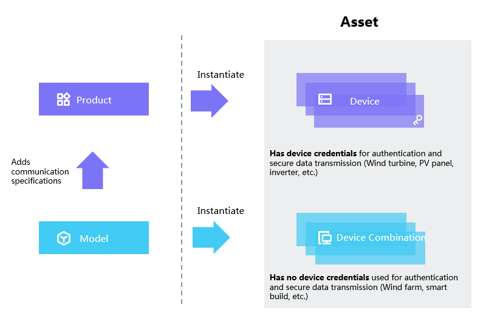

# Concepts

This article introduces the major concepts involved in device management.

**Model**

A model is the abstraction of the features of an object that is connected to IoT. The model defines the features of the object’s attributes, measure points, services, and events.
For more information, see [Model overview](model/model_overview). A model can be associated to multiple _products_.

**Product**

A product, or product model, is a collection of devices with the same features. On the basis of the model, a product further defines the communication specifications for the device to connect to the internet of things. Such as the secure authentication mechanism and data format.

**Device**

A device is the instance of a product. A device is created from a product so that it inherits not only the 4 elements of model, but also the communication features, aka the device key-secret pair and device certificate used for secure communication.

**Asset**

An asset is an instance of a model. An asset is created from a model so that it inherits the 4 elements of model.
An asset can be:
- A single device, such as an inverter
- A group of devices, such as a wind farm. The model of a wind farm might define the overall active power and cumulative power generation of the site. However the data of the 2 measure points are not directly from "connection" as single devices do, but the aggregation of all devices in the site. In this case, the site does not need to have device key-secret pair for site-level connection.

A device is an asset, but an asset is not necessarily a device.
