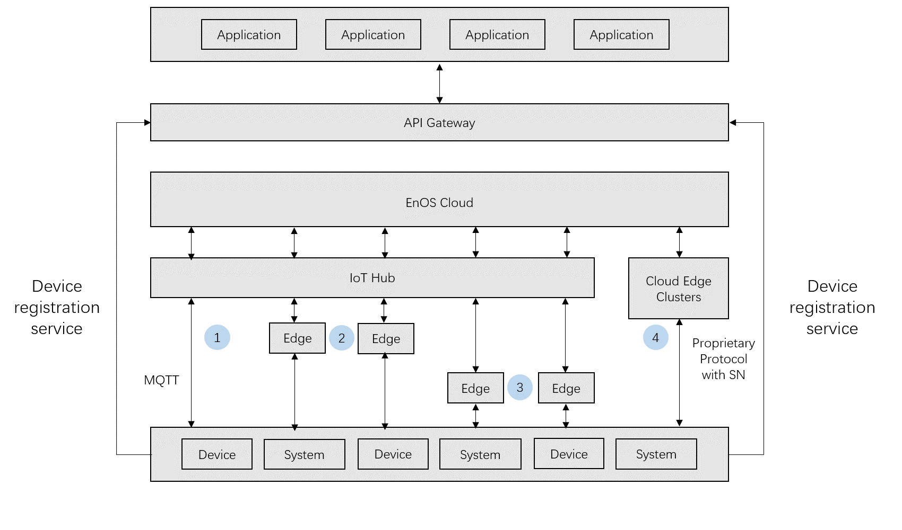

# 设备接入概述

EnOS接入服务帮助物联网开发人员进行设备全生命周期管理，该服务建立设备与EnOS Cloud间的数据通道，并保障设备终端与EnOS Cloud间进行安全的双向通信。

EnOS接入服务提供以下主要功能：

## 设备接入
提供设备端SDK让设备边界接入IoT Hub。
- 提供MQTT设备SDK，既满足长连接的实时性需求，也满足短连接的低功耗需求。
- 提供设备直连和网关代理连接等接入方案，为企业异构网络设备接入的多种场景提供解决方案。

## 设备管理
提供完整的设备生命周期管理功能，包括：
- 设备注册
- 设备配置
- 远程控制
- 固件升级
- 实时监测
- 设备注销

## 模型管理
提供设备模型。设备模型使得来自众多厂家、成千上万种型号的设备能够统一于少量的通用模型，从而为简化基于设备数据的应用开发。

## 保护设备与云端的安全

**鉴权**
- 提供一机一密的设备认证机制，降低设备被攻破的安全风险，适合有能力批量预分配ID密钥烧入到每个芯片的设备。
- 提供一型一密的设备预烧，认证时动态获取三元组，适合批量生产时无法将三元组烧入每个设备的情况。

更多信息，参考[设备认证机制](deviceconnection_authentication)。

**通信安全**
- 通过CA证书机制对数据进行加密和解密，保证设备与云端通信的安全。
- 通过topic对通信资源进行隔离，避免设备访问未经授权的数据

## 概念

**模型**

模型是对接入物联网的对象的功能的抽象。模型定义了对象的属性，测点，服务，和事件四个维度的功能。更多信息，参考[模型概述](model_overview)。一个模型可被关联至多个产品。

**产品**

产品，或称为产品型号，是一组具有相同功能的设备的集合。在模型的基础上，产品进一步定义了设备接入物联网的通信方式。一个产品可包含多个设备。

**设备**

设备是模型的实例。一个设备属于某一种产品。

## 技术架构

如上图所示, 设备可以直连或通过edge连接至EnOS IoT Hub。EnOS IoT Hub接受直连设备或edge通过MQTT协议进行通信。MQTT是一种轻量级基于TCP/IP的开源物联网协议。EnOS的MQTT协议支持以下功能：
- 数据基于话题（topic）的订阅（subscription）与发布（publish）
- RRPC

数据通过IoT Hub上送至EnOS Cloud中会由规则引擎分发至不同存储中用于以下用途：
- 时序数据库
- 告警引擎
- 流式计算

## 功能模块

### IoT Hub

IoT Hub is a cloud broker service that EnOS™ provides for device connection.

The cloud broker provides the following functions:

- Safe and reliable large-scale bi-directional message transmission from the devices to the cloud.
- Forwarding the data from the client to corresponding subscribers on EnOS™.
- Providing license authorization and creation of thing and policy themes.
- Exposing interface for connections from MQTT clients.

### EnOS™ Edge

Edge is the front end of Envision EnOS™ IoT platform for data acquisition. It is used to collect on-site device data or connected to a third party system for data acquisition and transmission of data to the EnOS™ Cloud. Edge, as software, supports data acquisition, multiple communication conventions, local caching and breakpoint continuation. It can either deployed in a cloud machine or an on-site hardware of a specified brand model. An edge must have a legal serial number (SN) assigned by Envision to be recognized by EnOS™ Cloud.

## 接入方案

EnOS主要提供以下接入方案：
- 设备无需通过网关（在我们的场景中，即edge），直接与云端IoT Hub进行连接及通信，完成鉴权，数据上报的场景。通过该方案连接的设备称为_直连设备_。
- 设备通过edge与EnOS IoT Hub连接。通过该方案连接的设备称为_子设备_。网关代理子设备，帮助他们完成身份的鉴权、上线、数据发送等操作。

通常根据设备的硬件能力及对设备连接的安全性要求选择接入方案。有关接入方案的选择的详细信息，参考 [设备接入方案](connection_scenarios).
