# 添加EnOS Edge网关

当使用EnOS Edge网关接入子设备时，需要对edge网关进行配置，该文章描述如果配置edge网关，完成子设备与edge网关的连接配置。

## 开始前准备

1. 你必须已获得Edge网关的序列号（SN）。
2. 你必须已经完成对edge网关的初始化。Edge网关硬件初始化等工作通常由远景项目团队完成，详细可以咨询远景的项目经理。

## 步骤1：添加和激活Edge网关

1. 在EnOS控制台中选择**设备Edge接入 > Edge管理**。
2. 在页面左上方点击**添加**按钮，输入Edge网关的名称和序列号。
3. 点击**保存**完成Edge网关添加。

Edge网关添加成功后，在**Edge管理**页面，可以查看每一个Edge的名称，SN，版本，以及当前通讯状态，发布状态等信息，如下图所示：
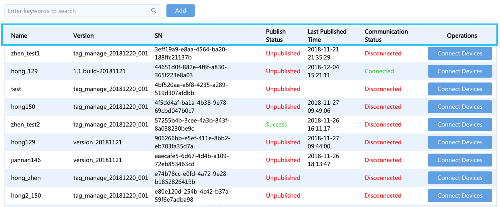

## 步骤2：接入子设备

完成edge网关的添加后，就可以使用该edge网关完成子设备的数据接入。在表格中点击edge网关记录后的**子设备接入**按钮，进入到Edge网关子设备接入配置页面。

### 添加连接

接入子设备的首要步骤是配置为edge网关添加通讯连接。根据实际需要，一个Edge下可添加多个连接，需要根据规约类型选择连接方式。根据以下步骤添加连接：

1. 点击页面中的**添加连接**按钮后。
2. 在弹出的对话框中填写连接的名称，选择连接方式，并根据所选连接方式设置连接参数。

如下图示例，edge作为TCP/IP客户端，因此配置的连接参数即为服务器的IP地址和端口号。

*注意：通常Edge不会直接连接对端服务器或设备，而是连接到一个网络网关，再由此网关连接到对端服务器或设备，因此需要注意网关IP地址和端口号与Edge的映射配置。*

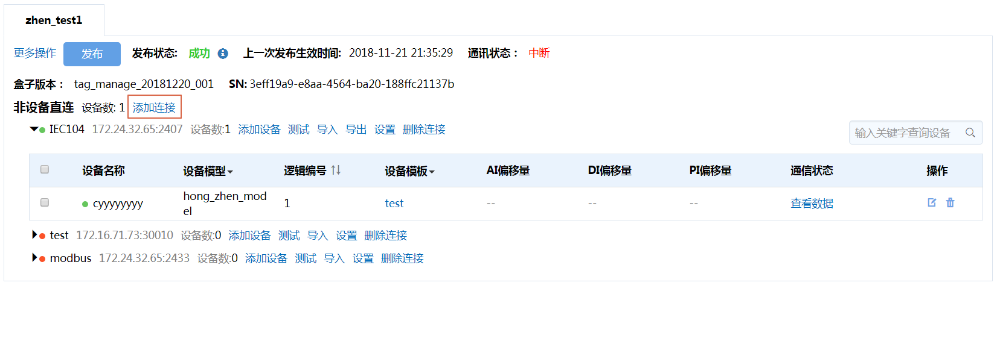

*图：添加连接示例*

### 添加设备

添加连接后，下一步工作是向连接中添加设备。如下图所示：

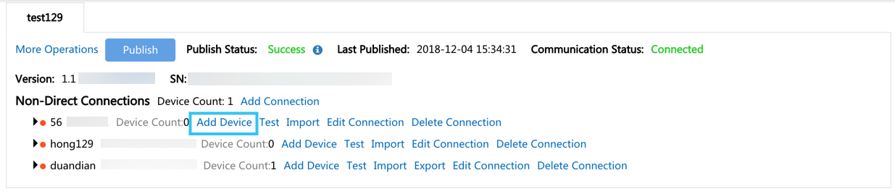

*图：向连接中添加设备*

**添加设备**

1. 在连接下点击**添加设备**按钮。
2. 选择需要添加的设备所属的产品，然后选择需要添加的设备，并选择设备需要关联的设备模板，点击**保存**。如下图所示：

  *注意：需首先选择同一种设备，此后才能为这些设备选择设备模板，设备模板相当于设备通讯驱动，里面中包括了设备通讯的点表，通讯规约，规约配置文件等信息。具体可以参考[管理模板](managing_templates)*

  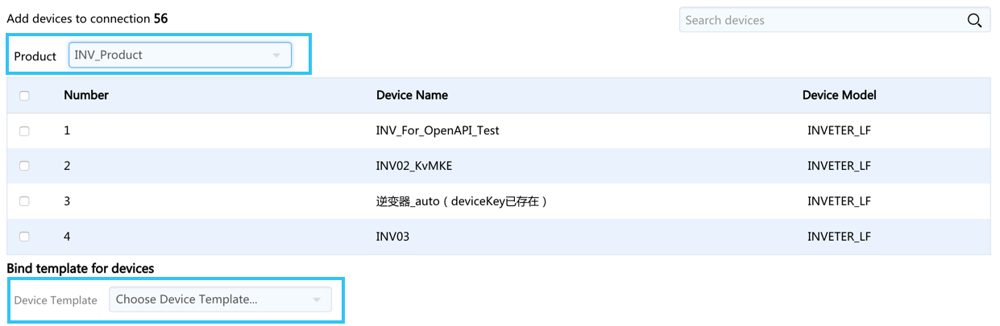

  *图：添加设备*

**更新设备信息**

若所添加的设备信息需要更新，点击连接下的**导出**按钮导出设备连接信息表，填写完成后再点击**导入**以上传此信息表。如下图所示：

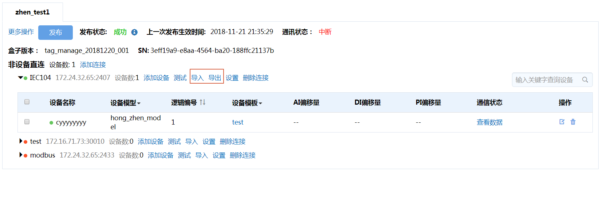

*图：更新设备信息*

*图：设备连接信息表*

<!--点击设备后的**删除**按钮可以从连接中删除此设备。若需批量删除设备，则勾选此连接下需要删除的设备，而后点击批量删除按钮即可。-->

### 配置逻辑地址或偏移量

由于一条连接下接入了多个设备，因此需为每个设备配置其逻辑地址及各类点的偏移量。其配置方法取决于所采用的通信规约及其设置。可以逐个设备进行配置，也可导出设备连接信息表线下配置完成后再导入系统，实现批量配置。

- 逐个设备进行配置

   点击设备后的**编辑**图标，可对此台设备进行编辑

   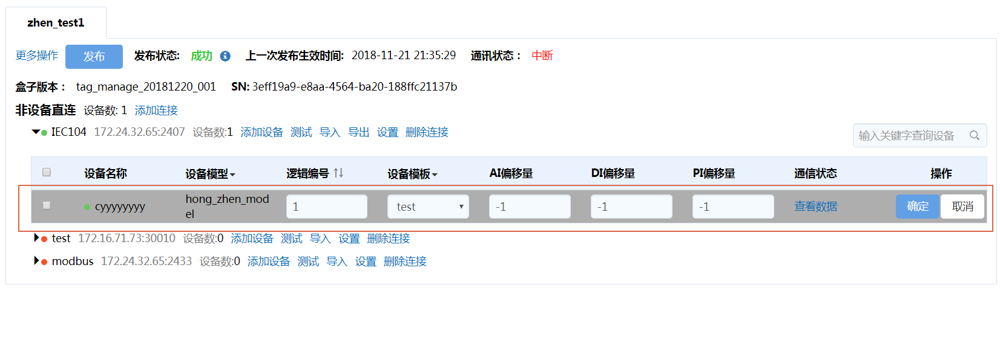

   *图：逐个设备配置逻辑地址及偏移量*

- 批量配置

   点击连接下的导出按钮，下载连接信息表填写后，再点击导入按钮上传信息表，如下图所示：

   

   *图：设备连接信息表*

   导出的表中支持AI，DI，PI，AO，DO，PO偏移量的配置。基本的配置方式为用短划线连接，如`0-50`，当同时存在多个偏移量时，可用`\#`隔离，如`0-50\#1000-1050`。

### 发布配置

完成上述各种配置后，需将配置发布到Edge。点击发布，即可将配置发布到对应的Edge上，并可见发布状态。只有发布后，所做的配置才会生效。如下图所示：

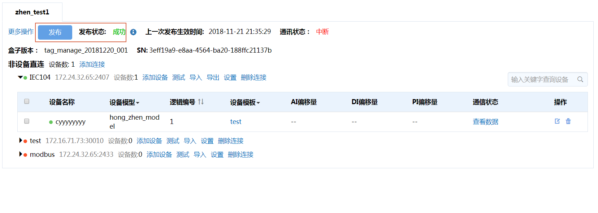

*图：发布配置到Edge*

## 步骤3：测试通信

完成并发布到Edge后，需检查配置是否正确。在连接配置页面，提供了通信指示灯，当设备在传输层（TCP/IP层）连接正常时，指示灯为绿色，否则为红色。如下图所示：

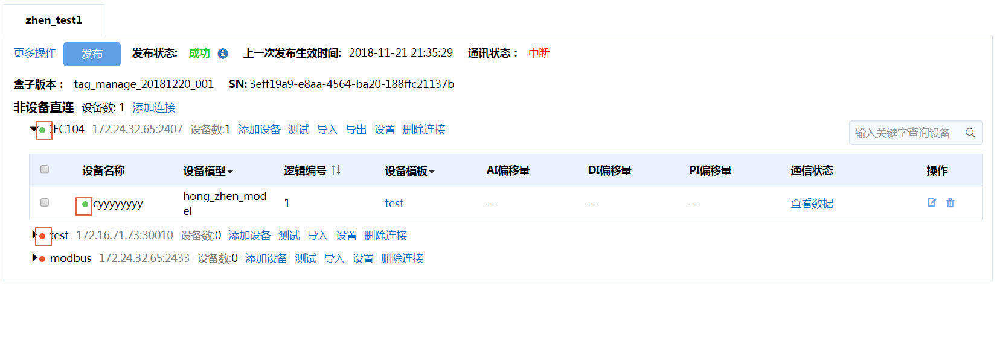

*图：传输层通信状态指示图标*

通信中断的原因有多种，包含但不限于以下原因：
- 配置没有下发
- 配置有误
- 场站端的通信有异常
为此，需要有进一步的调试来帮助用户定位问题所在。EnOS Edge提供了通信测试功能以帮助实现此目标。

点击连接下的**测试**按钮，进入如下图所示的连接的批量测试页面：

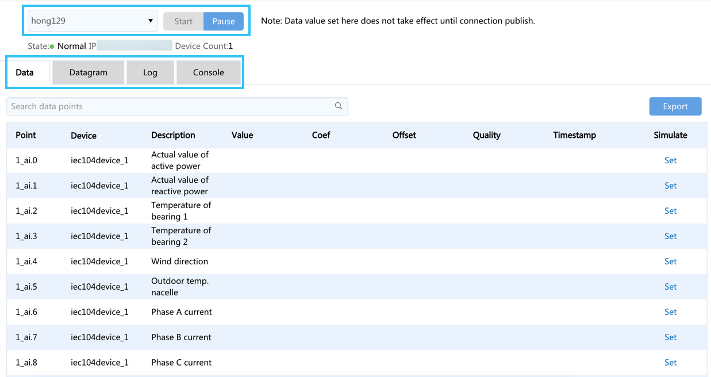

*图：批量通信测试概览*

- 你可以通过下拉菜单切换连接。
- 你可以点击**开始/暂停**按钮以启动或暂停通信测试功能。

批量测试提供了4项功能，分别为：数据、原始报文、日志和控制台。通过点击相应的标签页可以在不同功能间切换，以下内容描述各标签页用法及信息含义：

### 数据

在数据标签页，你可查看本连接下的所有设备，或者筛选所需查看的设备，查看其在edge中的采集点数据更新情况。

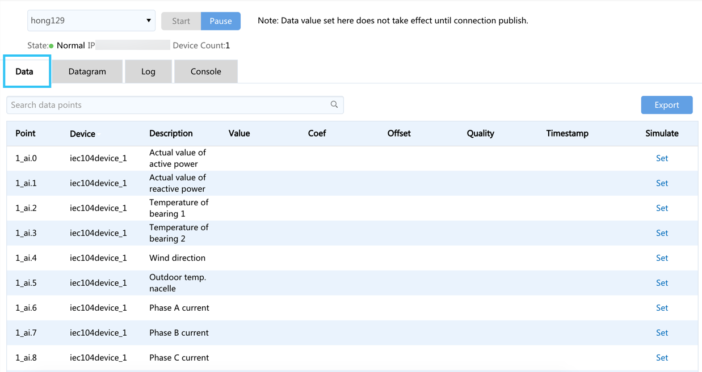

*图：数据功能*

该测试功能同时支持遥测、遥信点的置数。点击**添加置数**，可设值，点击**发送**后可向云端发送所设置的值。点击一次发送一次，不会终止原始数据的上传，相当于插了一个值送上云端。

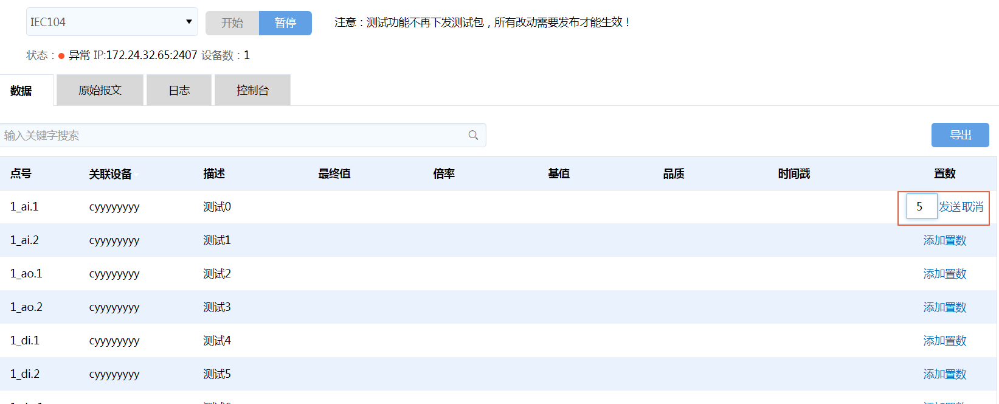

*图：置数功能*

### 原始报文

在原始报文标签页，你可以查看和复制原始收发报文。

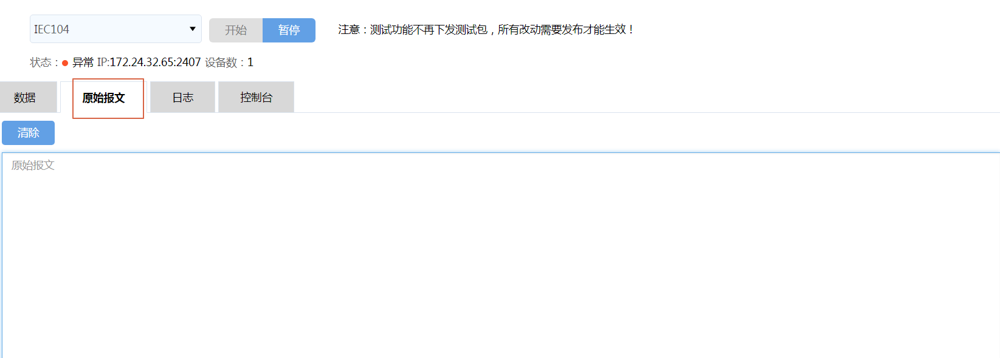

*图：原始报文功能*

### 日志

为避免信息泛滥，该标签页隐藏了info类日志，只显示warning和error类型的日志，用于辅助用户判断通信故障原因。

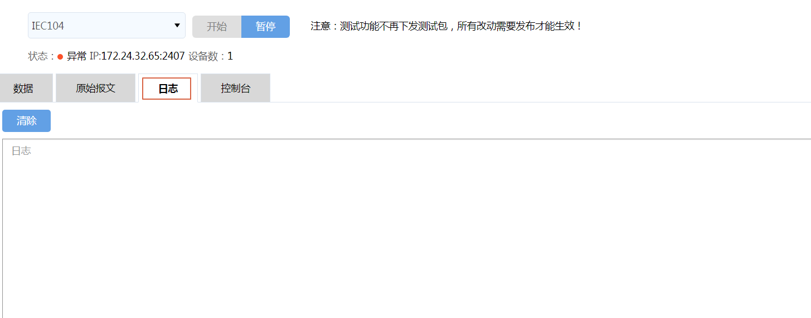

*图：日志功能*

### 控制台

在该标签页，你可以使用常用的通信调试命令，包括基本ping测试，本机IP查看，Telnet命令和TCP连接查看命令。
- ping测试需在输入框中填写需要ping的IP地址
- Telnet测试需填写IP和端口号

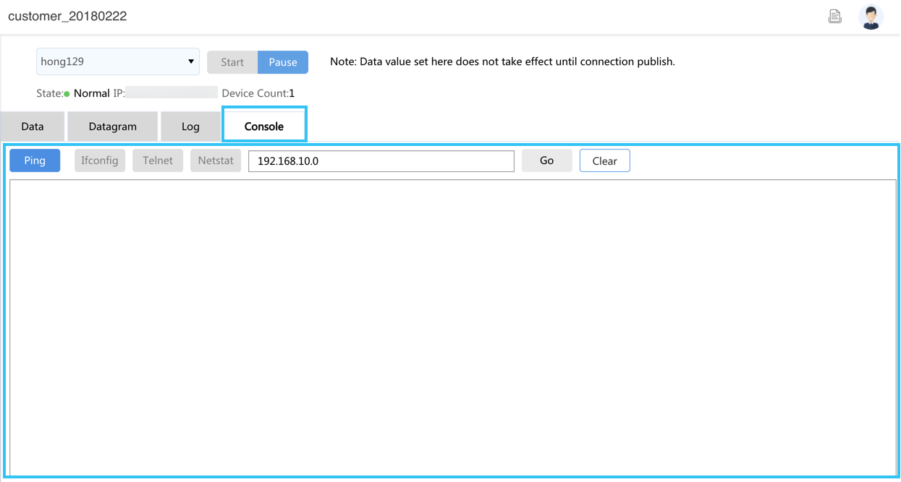

*图：控制台功能*

### 单台设备的通信测试

在每一个连接下的的设备列表页面，点击单设备的**查看数据**按钮，可对单台设备进行通信测试，查看此设备对应的Edge中的数据。此功能与批量通常测试中的数据功能一致，只是这里仅对单台设备进行测试。

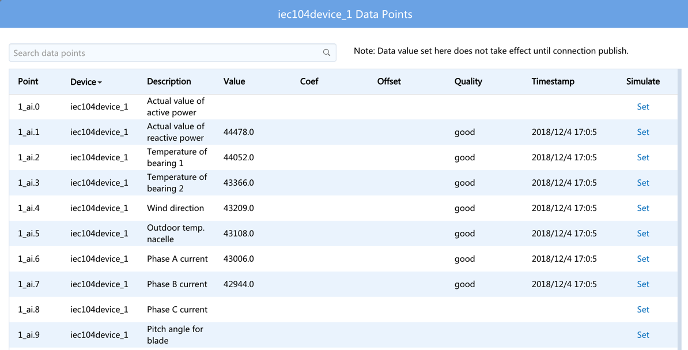

*图：单台设备通信测试功能*

## 总结

在Edge网关中完成子设备的接入配置后，这些子设备的数据即会自动上送到EnOS云端。
