# Creating and Managing Device Templates

A device template works as a bridge for device access. It consists of two parts: the protocol and the mapping relationship of device measure points. For an actual device, the names of its measure points are often customized, and cannot be identified directly by the system. Therefore, it is necessary to map the customized actual measure points to the domain points of standard device models. On the other hand, protocol configuration is also required for device access.

Steps to create a device template:

*Figure: Three Steps to Managing Device Templates*

A device template can be created mainly in two ways:
- Created from scratch.
- Created and later modified based on an existing device template. You can choose this method when the scenario requires a device template that is similar to an existing one. By copying an existing template and slightly modifying the duplicate to obtain a new template, you can reduce your workload.

## Creating a Brand New Device Template

1. In the navigation bar of the EnOS Console, click **Device Access via Edge > Device Template**.
2. Click **New Device Template**. In the pop-up window, enter basic device information, select a device model, and click **Save**.
3. Click the "Edit" button  next to the newly created template record to enter the Template Details page. The Template Details page includes (from top to bottom): the basic info editing section, the point table upload section, and the mapping relationship configuration section, as shown in the figure below:

  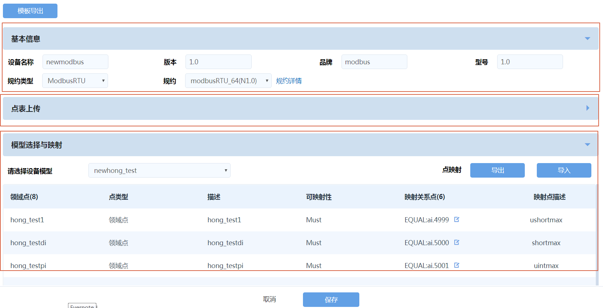

  *Figure: Device Template Editing Page - Taking Fan as an Example*

Follow the instructions below to configure a device template.

### Configuring Basic Info

In the **Basic Info** section, enter the basic information of the device, select the protocol type as well as the specific protocol.

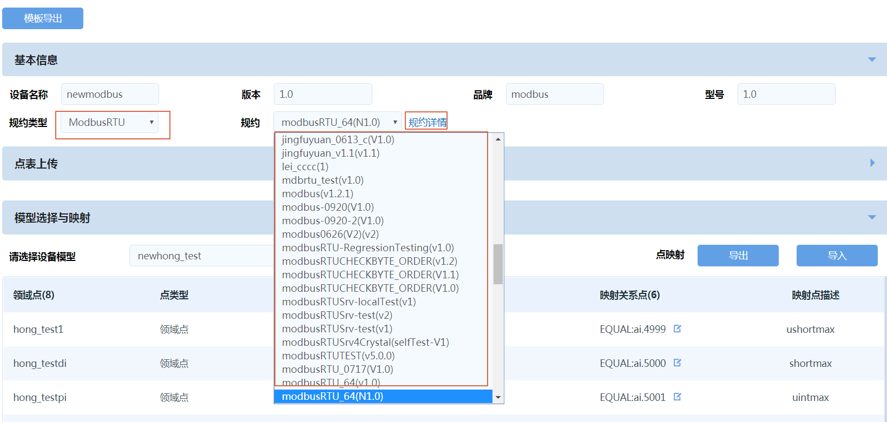

*Figure: Basic Template Info Editing*

- You can view and select the general protocols currently supported by the EnOS Edge as well as their associated templates. To view the description of each protocol so as to choose the right one, click on the Protocol Details link and move the cursor to the  icon in the window that appears.
- If no suitable protocol is found, you can contact the system administrator of the platform. You can also re-develop the protocol and upload it to the protocol management center for editing, updating, and more operations. For information on developing new protocols, please refer to [Creating Protocol](creating_protocol).

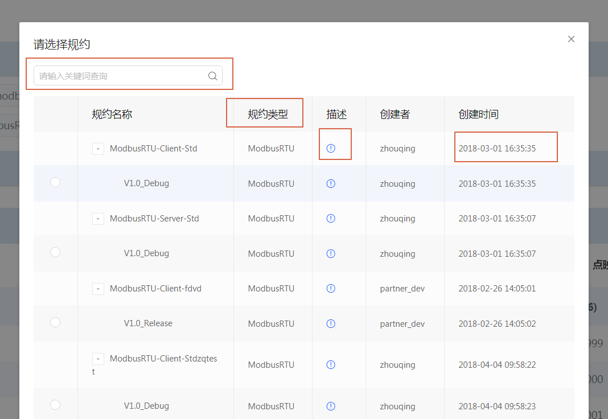

*Figure: Protocol Details Page*

### Uploading Point Table

In the **Point Table Upload** section, you will need to edit two configuration files:
- `config.sys` is a parameter configuration file relating to communication protocols
- `point.csv` is the actual measure point table of the device.

Download the `config.sys` and `point.csv` templates, fill in both templates, and upload them.

**Note**: The point.csv point table shall be in UTF-8 BOM format to avoid display errors and other issues. If there are values in the "alias" column of the point.csv table when you are updating it (i.e., uploading a new point table), you will need to first upload an empty point table to overwrite the original table before uploading the actual point table to avoid errors. *

If you have chosen a communication protocol in the previous step and successfully uploaded the `point.csv` table here, you will see the measure point information in the `point.csv` table in the preview section below, as shown in the following figure:

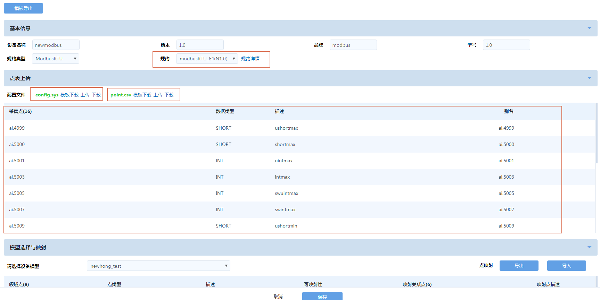

*Figure: Protocol Selection and Point Table Import*

### Selecting Model and Configuring Mapping Relationship

In the **Model Selection and Mapping** section, you can configure mapping relationships to match customized actual points with standard device model points. The main steps include:
1. Select the standard device model.
2. Find the measure point record for which a mapping configuration is required, and click the  button to the right of the standard model point.

  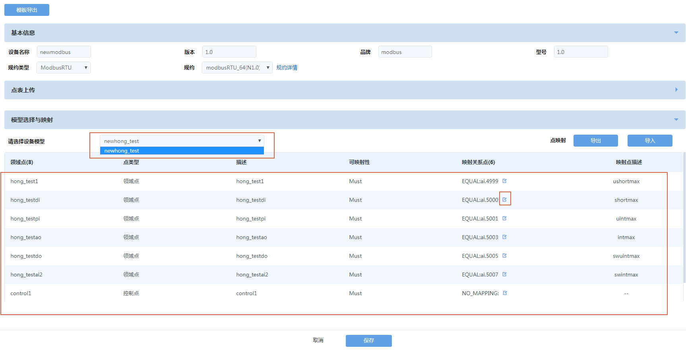

  *Figure: Standard Model Selection and Mapping Relationship Configuration*

3. Select the actual acquisition point in the pop-up window, as shown in the figure below:

  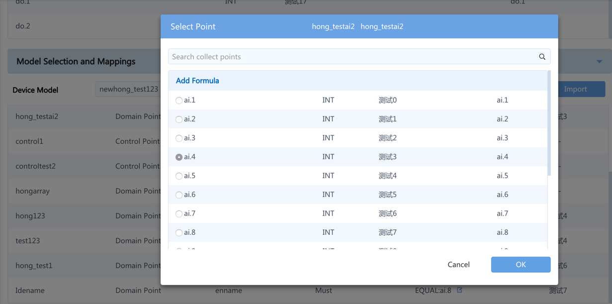

  *Figure: Mapping Relationship Configuration*

  In the search bar of the pop-up window, you can enter a keyword to search for the acquisition points, and the system will use it as a filter and show the measure points that contain the keyword for users to choose, as shown in the figure below.

  - If it is a simple one-to-one mapping, just check the corresponding measure point
  - For complex mappings, you can click the "Add Formula" button to configure a mapping formula, as shown in the figure below:

    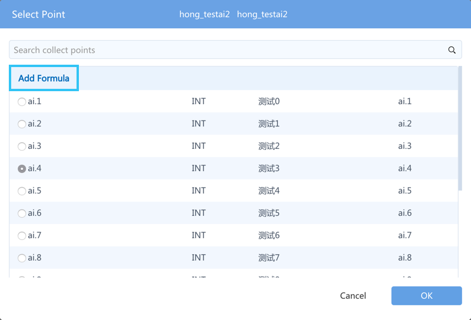

    *Figure: Add Formula Button*

    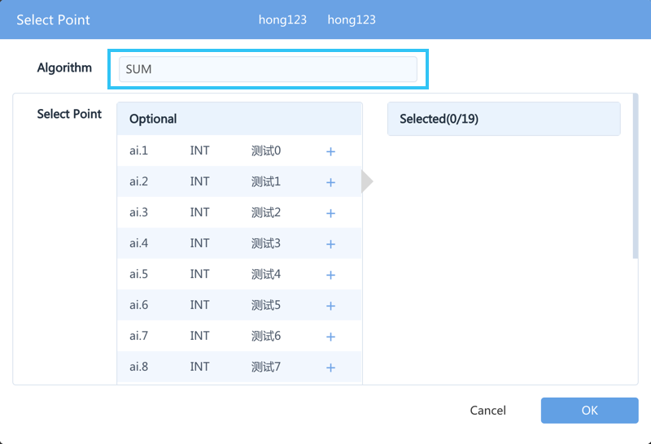

    *Figure: Select Formula*

    Take the addition formula "SUM" as an example: select "SUM" in the formula algorithm column and, in the acquisition point box, click the  next to the corresponding point in the order of adding the points. As you can see in the figure below, the added formula is "ai.4999+ai.5001", consistent with the order of clicking.

    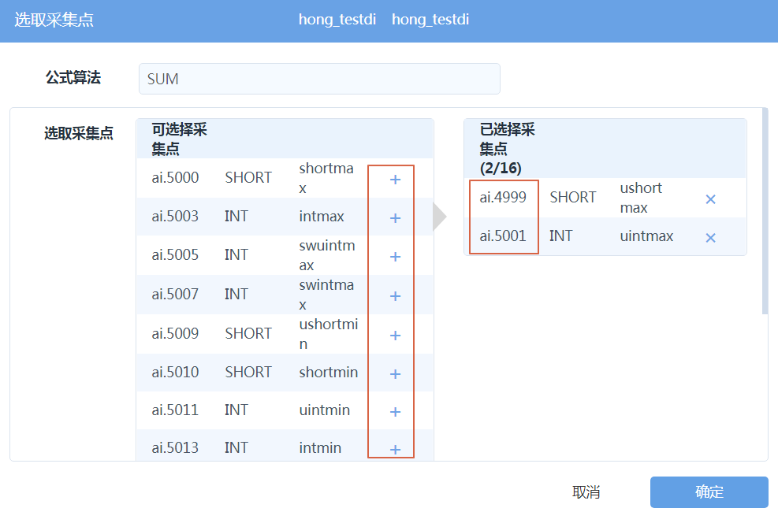

    *Figure: Notes for Adding the SUM Formula*

  **Notes**: For some formulas, the order of adding the points is important. For example, in the cross
  product operation, when you select "cross
  product" in the formula algorithm column and then select four points in order, the added formula will be "(ai.4999\*ai.5000+ai.5009\*ai.5010)". The operand column in the figure works as a coefficient; if it is set to 0, no operation will be made. The operand in the figure below is 0.01, so the final formula added is "(ai.4999\*ai.5000+ai.5009\*ai.5010)\*0.01".

  

  *Figure: Point Selection Order and Operand*

### Batch Configuration of Mapping Relationship

You can configure all the mappings at once by performing the following steps:

1. In the **Model Selection and Mapping** section, click the **Export** button to download the mapping table of domain points.
2. Edit the table to map the relationship of all points, and then click the **Import** button to upload the mapping table.

  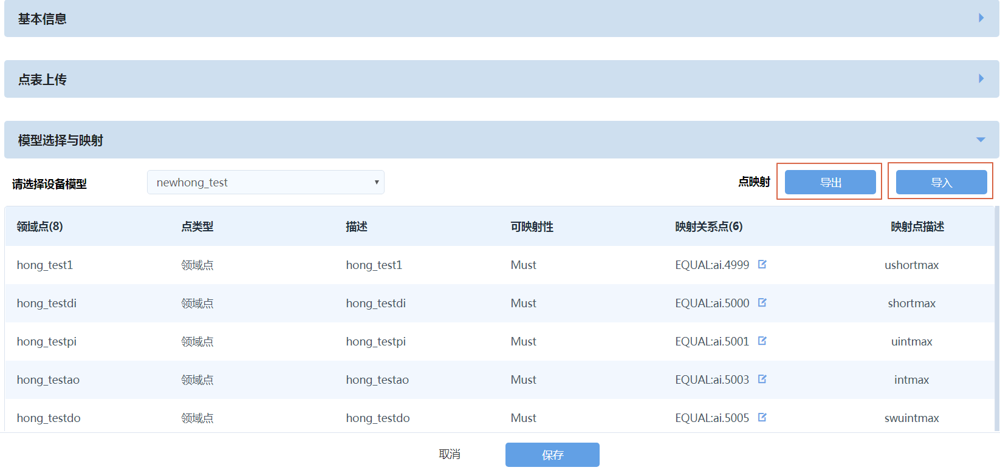

  *Figure: Batch Configuration of Mapping Relationship*

  

  *Figure: Mapping Relationship Table*

  *Note: You only need to enter the numbers of acquisition points in the mapping column of the mapping relationship table; the mdesp column is used to describe the acquisition points and requires no input. After successfully uploading the mapping relationship table, download the list of domain points to obtain a table that contains mapping relationship. The table now includes the description of acquisition points (because the description can be automatically obtained from the driver configuration file point.csv) *

  After configuring the mapping relationship, you can see the number and description of the acquisition points of each corresponding standard model point, as shown in the figure below. Click "Save" to finish the device template editing.

  **Notes**:

  - Depending on the application requirements of the domain, a device model point may or may not require mapping relationship configuration;

  - Points that require a formula for mapping must be added manually, and shall not be operated directly via import/export;

  - After clicking **Export** to export a configured mapping table, the exported csv file will not include the points mapped using formulas, but such points do exist in the background.

## Creating a Device Template by Copying

You can view all the device templates of the current customer on the Templates menu page. When the device template required by a new device is similar to an existing device template, you can reduce the creation workload by copying the existing template.

Find the original device template you need and click the "Copy" button; enter a name for the new device template to complete the creation.

**Note**: The name of device template must be unique to avoid error messages.

After that, you will only need to modify the device template duplicate to meet your needs, as shown in the figure below:

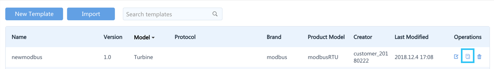

*Figure: Copy Device Template*

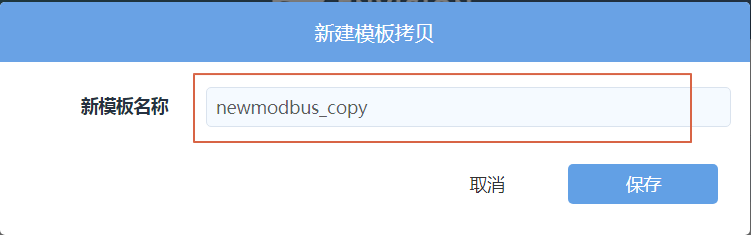

*Figure: Enter a Name for the New Device Template*

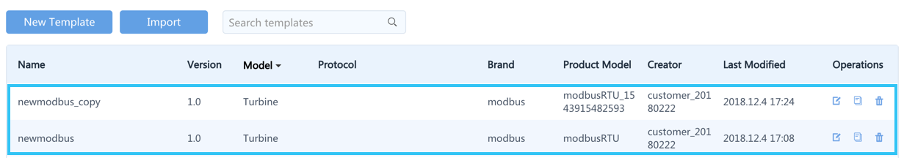

*Figure: Finish Copying the Device Template*

## Modifying and Deleting Device Templates

On the **Template Management** page:
- To modify a template, click the template's **Edit** button to enter the template details page of the target device.
- To delete a template, simply click the template's **Delete** button.

*Note: Be cautious when modifying or deleting a template that is in use, as the operation will affect all the device instances that are using the template. *
