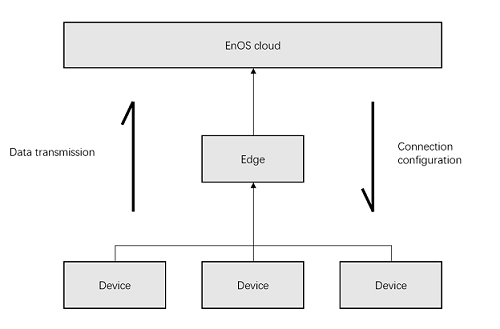
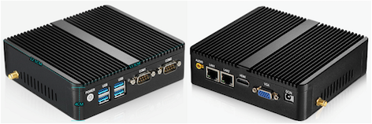
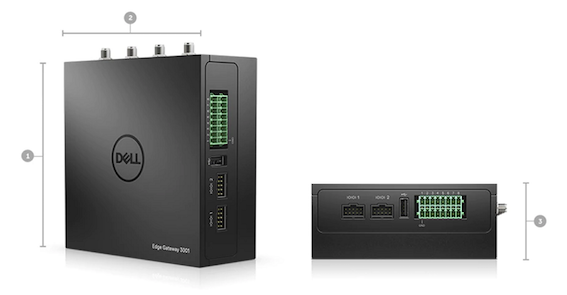
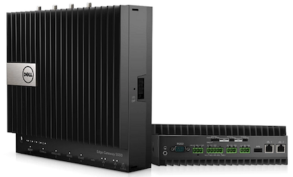

# EnOS™ Edge connection overview

An edge extends the connectivity of EnOS™ to support more communication protocols and data formats. The edge can be hardware-based deployed on-site or software-based deployed in the cloud.

设备数据传输的完整的链路是设备将数据发送给edge，然后edge统一汇总以后将数据上传至云端，数据传输是一个自下而上的过程。而设备接入配置，是一个自上而下的过程，先配置云端与edge的连接，然后在配置edge与设备之间的连接。

Because the devices connected through EnOS™ can be of different product models with different names for the data collecting points, you'll need to specify the mapping between the data collecting points and the standard model points through a device `template`.

## Key concepts

**Template**

Device templates, which play as the adaptor between device models and real devices, mainly define the communication protocol and mapping relationship between the data acquisition point and device model point.

### Connection mode

The EnOS™ Edge can connect to the EnOS™ cloud in the following mode:

#### TCP/IP client
Edge connects the cloud as a TCP/IP client.

#### TCP/IP server
Edge connects to the cloud as a TCP/IP server

#### HTTP(s) client
Edge connets to the cloud as an HTTP(s) client.

#### HTTP(s) server
Edge connects to the cloud as an HTTP(s) server.

### Short or long connection

The connection between the EnOS™ Edge and the EnOS™ cloud can be a short connection or long connection.

#### Short connection

1. The client initiates the connection request. The bi-directional connection is established when the server receives the request.
2. The client sends messages to the server and gets responses from the server. A session is completed.
3. Either party can initiate the termination request to close the connection. Usually, it is the client to initiate the termination request.

#### Long Connection

1. The client initiates the connection request. The bi-directional connection is established when the server receives the request.
2. The client sends messages to the server and gets responses from the server. A session is completed.
3. The connection is not terminated after a session is completed. Future transmissions reuse the same connection.

## Applicable scenarios of EnOS™ Edge connection

In energy, power, building, and energy storage industries, most devices are not
compatible with MQTT protocols. In these scenarios, Edge with multiple
convention analysis abilities is often used.

Moreover, instead of communicating directly with EnOS™ platform, some devices are connected to a third party system (such as SCADA system), and the data are relayed via the third party system to the EnOS™ platform. Traditional SCADA systems typically don’t support relay via MQTT protocols. In these scenarios, Edge will also be selected.

## Examples edge devices

