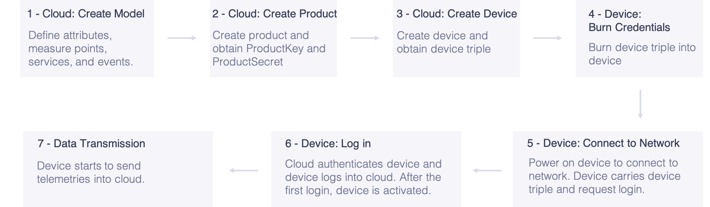
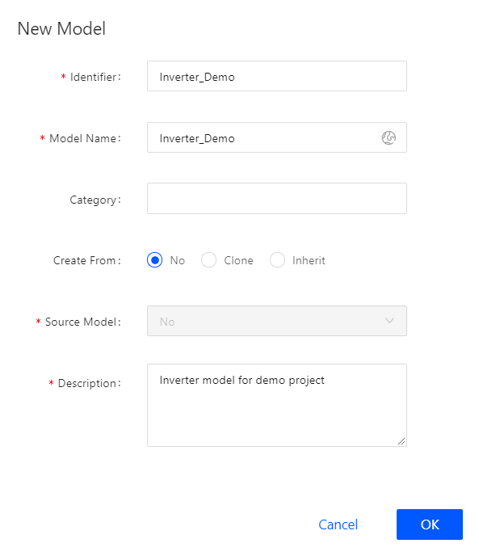
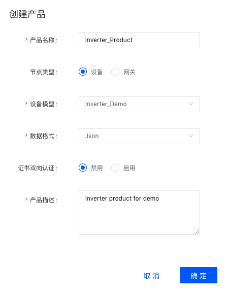
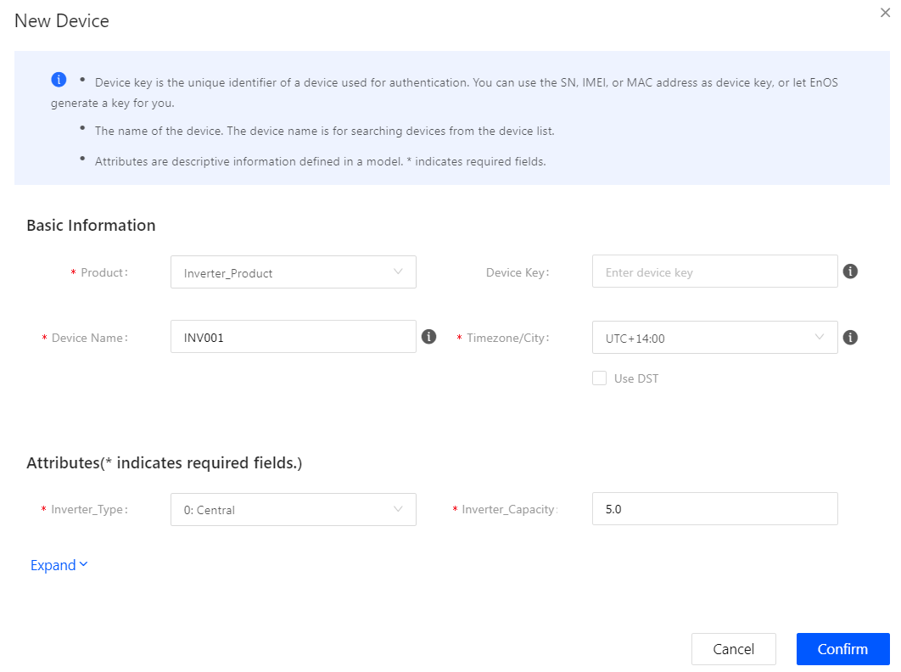
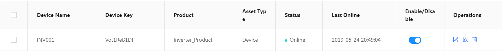

# Getting Started With Direct Device Connection

This article helps you quickly learn how to provision direct-connecting devices to the EnOS Cloud, how to send device telemetry, and how to check device communication state from the EnOS Console.

## About the Scenario

For information about the connection scenario of this task, see "Scenario 2.2" in [Device Connection Schemes](connection_scenarios).

## About This Task

Here we take the household PV inverter connection as an example. The inverter device triple is burned into the inverter during manufacturing. After you power on and connect the inverter to the network, the inverter is connected to the IoT Hub based on the device triple authentication. The overall process is shown below:

  

As shown in the flowchart above, the procedure falls into the following steps:
1. Create a device model for the inverter
2. Create a product for the inverter
3. Register the inverter
4. Simulate the inverter to send data via device SDK
5. Check device communication status
6. View device data

## Step 1: Create a Device Model

This step assumes that there is no device model to be reused. We create a new model named **Inverter_Demo** with the features defined as follows:

<table>
    <tr>
      <th>Feature Type</th>
      <th>Name</th>   
      <th>Identifier</th>   
      <th>Data Type</th>   
      <th>Value</th>   
    </tr>
    <tr>
      <td>Attribute</td>
      <td>Inverter type</td>     
      <td>invType</td>
      <td>enum</td>  
      <td>{0:Central,1:String}</td>      
    </tr>
    <tr>
     <td>Attribute</td>
      <td>Component capacity</td>
      <td>capacity</td>     
      <td>float</td>
      <td>kWp</td>      
    </tr>
    <tr>
      <td>Measure Point</td>
      <td>Active power</td>     
      <td>INV.GenActivePW</td>
      <td>float</td>  
      <td>kW</td>      
    </tr>
    <tr>
      <td>Service</td>
      <td>Control</td>     
      <td>INV.Control</td>
      <td>--</td>  
      <td>Invoke Method: Asynchronous</td>      
    </tr>
    <tr>
      <td>Event</td>
      <td>Error information</td>     
      <td>Error</td>
      <td>--</td>  
      <td>Event Type: Error</td>      
    </tr>
</table>

The steps to create this model are as follows:

1. In the EnOS Console, click **Model** from the left navigation panel.
2. Click **New Model**, and provide the following settings in the **New Model** window:
  - **Identifier**: Inverter_Demo
  - **Model Name**: Inverter_Demo
  - **Model Name (en)**: Inverter_Demo
  - **Category**: NA
  - **Create From**: No
  - **Source Model**: NA
  - **Description**: Inverter model for demo project

  

3. Click **OK** to complete the operation.
4. Click **Edit**, and click the **Feature Definition** tab in the **Model Details** screen.
5. Click **Add**, and provide the following settings in the **Add Feature** window:
  - **Attribute 1**
    - **Name**: Inverter_Type
    - **Identifier**: invType
    - **Data Type**: enum
    - **Enum Items**:
      - Value: 0; Description: Central
      - Value: 1; Description: String
    - **Required**: Yes
  - **Attribute 2**
      - **Name**: Inverter_Capacity
      - **Identifier**: capacity
      - **Data Type**: float
      - **Unit**: kWp
      - **Required**: Yes
  - **Measure Point**
    - **Name**: Active_Power
    - **Identifier**: INV.GenActivePW
    - **Data Type**: float
    - **Point Type**: AI
    - **Unit**: kW
  - **Service**
    - **Name**: Control
    - **Identifier**: INV.Control
    - **Invoke Method**: Asynchronous
    - **Input Parameters**:
      - Parameter Name: control
      - Identifier: control
      - Data Type: enum
      - Enum Items:
        - Value: 0; Description: Stop
        - Value: 1; Description: Start
    - **Output Parameters**:
      - Parameter Name: execResult
      - Identifier: execResult
      - Data Type: enum
      - Enum Items:
        - Value: 0; Description: Failure
        - Value: 1; Description: Success
  - **Event**
    - **Name**: Error
    - **Identifier**: Error
    - **Severity**: Error

6. Click **Confirm** to complete the operation.

For details on device model settings, see [Creating Model](cloud/creating_model).

## Step 2: Create a Product

In this step, we create a product called **Inverter_Product**. We assume that a device of this product model sends data in JSON format and the data transmission is not encrypted using CA certificate.

1. In the EnOS Console, select **Device Provisioning > Products**.
2. Click **New Product**, and provide the following settings in the **New Product** window:
  - **Product Name**: Inverter_Product
  - **Asset Type**: Device
  - **Device Model**: Inverter_Demo
  - **Data Format**: Json
  - **Certificate-based Two-way Authentication**: Disable
  - **Product Description**: Inverter product for demo

  

3. Click **Confirm** to complete the operation.

For details about product settings, see [Creating Products](cloud/creating_product).

## Step 3: Register the Device

In this step, we create a device named **INV001**, which belongs to the **Inverter_Product** product model created in the previous step.

1. In the EnOS Console, select **Device Provisioning > Devices**.
2. Click **New Device**, and provide the following settings in the **New Device** window:
  - **Product**: Inverter_Product
  - **Device Name**: INV001
  - **Inverter Type**: 0: Central, indicating centralized inverter
  - **Component Capacity**: 5.0
  - **Device Key**: Optional, generated automatically by system

  

3. Click **Confirm** to complete the operation.

For details about device settings, see [Creating a Device](cloud/creating_device).

After you complete the device registration, obtain the device triple: `ProductKey`,`DeviceKey`,and `DeviceSecret`, which will be used in the following step.

## Step 4: Use Java SDK to Simulate Device Sending Telemetry

In this step, we use the device SDK to simulate sending the inverter active power to the cloud.

1. Obtain the [Device SDK](https://github.com/EnvisionIot/enos-mqtt-java-sdk). For more information, see the GitHub readme file.
2. Configure the EnOS Cloud connection as instructed in the readme file.
3. Configure the device triple (`ProductKey`,`DeviceKey`,`DeviceSecret`) into the sample connection program. The device triple is obtained when you register the device.
4. Modify the `postSubMeasurepoint` method, configure the name of the measure point that sends telemetry to the cloud. In this example, we send the active power point of the inverter, set the point name **INV.GenActivePW** and the corresponding point value.

For more information, see [Using the Device SDK](device/using_java_sdk).

## Step 5: Check the Device Connection Status

In the EnOS Console, click **Device Provisioning > Devices**, locate the device and check the status of the INV001 device and confirm that the device is **Online**.

  

## Step 6: Check the Device Data

1. In the **Devices** page, locate the device and click **View** to show the **Device Details** page.
2. Click the **Measure Points** tab, and select the **INV.GenActivePW** measure point, click **View Data** to view the historical data.
