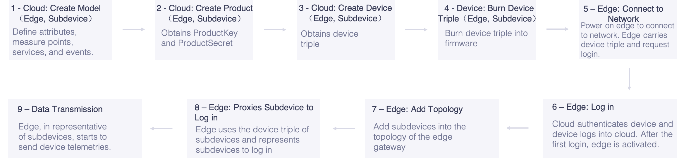
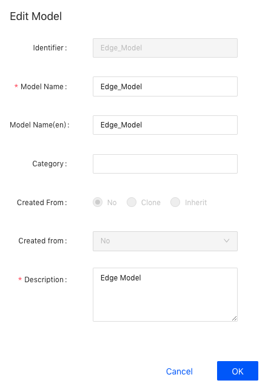
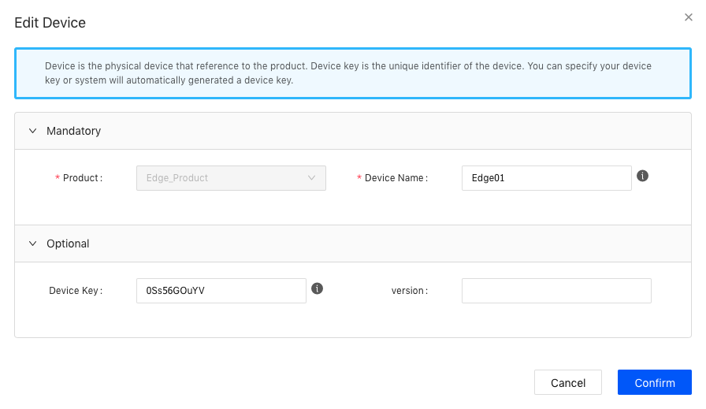

# 子设备通过edge连接至EnOS Cloud快速入门

该文章帮助你快速入门将子设备与edge预配至EnOS Cloud，使子设备通过edge连接并发送数据至EnOS Cloud，并从EnOS Cloud查看设备与edge的通信信息。

## 场景描述
接入场景参考[设备接入方案](connection_scenarios)当中提到的“场景1.2”。

## 任务描述

本示例以逆变器通过edge接入EnOS Cloud为例进行说明，edge采集逆变器数据，edge代理逆变器将数据发送至EnOS Cloud。整体接入场景如下图所示：
  

基于上述接入流程图，本示例主要有以下任务：
1. 创建设备模型
  - 网关模型
  - 逆变器模型
2. 创建产品
  - 网关产品
  - 逆变器产品
3. 注册设备
  - 网关设备
  - 逆变器设备
4. 网关配置
  - 使用EnOS Edge接入数据
  - 通过设备端SDK模拟网关代理子设备发送数据
5. 查看设备通信状态
6. 查看设备数据

## 前提条件

本示例的前提是你已经完成[直连设备连接快速入门](gettingstarted_device_connection)。
在本示例当中，只创建网关设备的模型、产品、设备。逆变器设备的相关配置复用**直连设备连接快速入门**。

## 步骤1：创建设备模型

在该步骤中假设没有可复用的edge模型，我们创建一个名为**Edge_Model**的edge设备模型。

1. 在EnOS控制台中选择**接入管理 > 模型管理**。
2. 点击在页面右上方**创建模型**, 并在**创建模型**窗口提供以下配置信息：
  - **模型标识符**： Edge_Model
  - **模型名称**：Edge_Model
  - **分类**：无
  - **模型关系**：无
  - **模型模板**：无
  - **模型描述**：Edge Model
  
3. 点击**确定**完成操作。
4. 点击**查看**，在模型详细信息界面中点击**功能定义**标签。
5. 点击**新增**，并在**添加功能**窗口提供以下配置信息：
  - **属性**
    - **名称**：版本/version
    - **标识符**：version
    - **数据类型**：string
    - **数据长度**：20
    - **是否必填**：是

有关设备模型设置的详细信息，参见[创建模型](creating_model)。

## 步骤2：创建产品

在该步骤中，我们创建一个名为**Edge_Product**的产品，该产品型号的edge设备通过JSON格式上送数据至EnOS云端。

1. 在EnOS控制台中选择 **接入管理 > 产品管理**。
2. 点击在页面右上方 **创建产品** ，可配置信息如下。
  - **产品名称**：Edge_Product
  - **节点类型**：网关
  - **设备模型**：Edge_Product
  - **数据格式**：Json
  - **证书双向认证**：禁用
  - **产品描述**：Edge Product

3. 点击 **确定** 完成操作。

有关产品设置的详细信息，参见[创建产品](creating_products)。

## 步骤3：注册网关

在该步骤中，我们创建一个名为**Edge01**的edge设备，该设备属于在上一步骤中创建的**Edge_Product**产品型号。

1. 在EnOS控制台中选择 **接入管理>设备管理**。
2. 点击在页面右上方 **添加设备**，在弹出窗口配置如下信息：
  - **产品**：Edge_Product
  - **Device Name**：Edge01
  - **版本**：选填，默认为空
  - **Device Key**：选填，系统自动生成

## 步骤4：网关配置

### 使用EnOS Edge接入数据
>注：该步骤只针对使用远景提供的EnOS Edge的场景，如果使用其他厂家的网关产品，请参考对应的网关配置指导

1. 向远景的项目管理人员申请一个Edge网关设备，申请后你将会获得一个Edge网关的SN
2. 接入Edge网关配置页面，添加Edge网关设备（填入获得的SN）
3. 在Edge网关中完成子设备与Edge网关的连接配置
4. 发布配置到Edge网关。

更多关于EnOS Edge网关配置相关内容，参考[Edge网关配置](https://docs.envisioniot.com/docs/enos-edge/zh_CN/latest/edge_overview.html)

### 通过设备端SDK模拟网关代理子设备发送数据
在该步骤中，我们通过设备端SDK模拟发送逆变器有功功率至云端。

1. 获取[设备端SDK](https://github.com/EnvisionIot/enos-mqtt-java-sdk)。更多信息，参考该SDK的GitHub readme文件。
2. 配置EnOS Cloud连接地址。
3. 将注网关和子设备的三元组（`ProductKey`,`DeviceKey`,`DeviceSecret`）配置到sample连接程序当中。
4. 修改**postSubMeasurepoint**方法，配置发送数据测点名称，这里发送逆变器有功功率点，设置点名**INV.GenActivePW**，以及对应的点值。
5. 调用示例方法：
  - 网关上线
  - 网关添加子设备拓扑
  - 网关代理子设备上线
  - 网关代理子设备发送数据

SDK具体使用参考[SDK设备端连接](using_sdk)。

## 步骤5：查看设备状态

进入控制台，选择**接入管理>设备管理**，查看Edge01和INV001设备的状态，确认设备处于在线状态。

## 步骤6：查看设备数据

进入控制台，选择**接入管理>设备管理**，进入**设备详情**，打开**测点**tab页面，选择一个测点，点击**查看数据**，可以查看历史数据记录。
