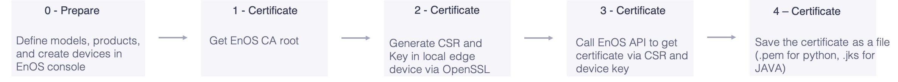
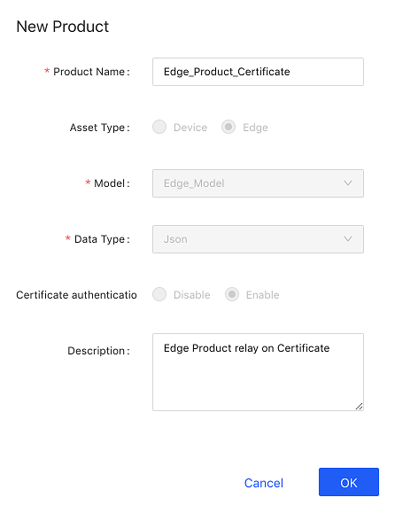
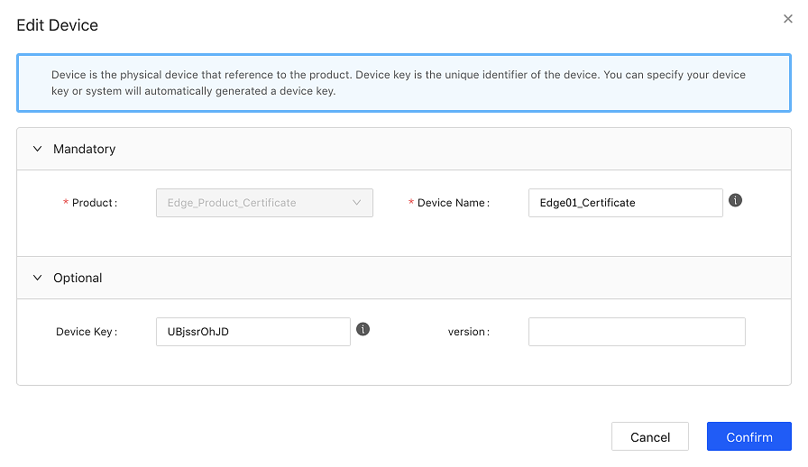
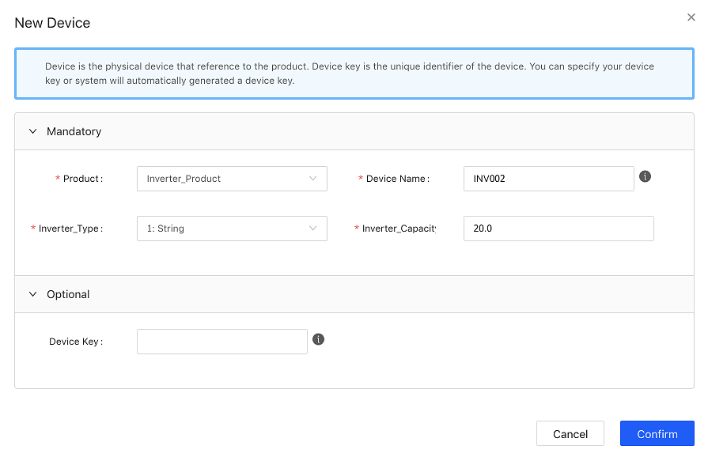
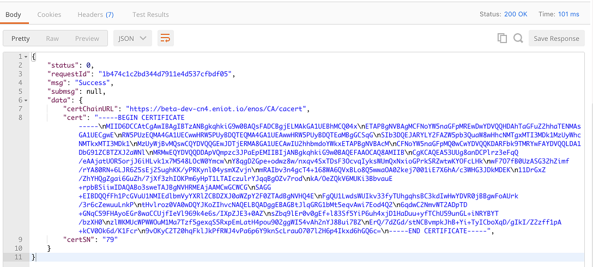

# 使用JavaSDK实现基于证书的双向认证快速入门

该文章帮助你快速入门如何基于Java SDK实现基于证书的双向认证连接EnOS Cloud。

## 开始前准备

前期准备整体流程如下图所示：




### 步骤0:创建模型、产品、设备

本步骤的前提是你已完成[直连设备连接快速入门](gettingstarted_device_connection)和[子设备通过edge连接至EnOS Cloud快速入门](gettingstarted_edge_connection)这两个示例。

**创建网关产品**

本步骤大部分与上述两个快速入门示例相似，差异点在创建网关产品时需要创建开启**证书双向认证机制**的产品。如下图所示：




逆变器产品不需要开启**证书双向认证机制**，因为逆变器是作为子设备由网关代理连接EnOS Cloud，只需要edge与EnOS Cloud进行基于证书的双向认证即可。

**创建网关设备**

基于以上产品创建网关类型设备Edge01_Certificate。如下图所示：



Edge01_Certificate的设备三元组如下，后续创建证书请求文件的时候会用到Device Key。
- Product Key:Et***YP6
- Device Key:UB***rOhJD
- Device Secret:jgWGPE***B7bShf2P5cz

**创建子设备**

逆变器设备参照[直连设备连接快速入门](gettingstarted_device_connection)进行创建。如下图所示：



### 步骤1：获取根证书

下载CA根证书`cacert.pem`，下载地址为：https://<cluster_name>.envisioniot.com/enos/CA/cacert
- 如果是公有云用户，<cluster_name>参考[EnOS Cloud集群信息]()。
- 如果是私有云用户，<cluster_name>请咨询远景智能客户经理。

### 步骤2：创建证书请求文件和私钥

使用openssl命令创建证书请求文件**edge.csr**和私钥**edge.key**，示例命令如下：

```shell
openssl req -new -newkey rsa:2048 -out edge.csr -keyout edge.key -subj /C=CN/ST=Shanghai/L=Shanghai/O=EnOS/OU="Edge Service"/CN="UB***rOhJD" -passout pass:123456  -sha256 -batch
```

证书请求文件**edge.csr**用于向EnOS Cloud申请证书，私钥**edge.key**用于解密被证书加密的内容。

创建证书命令具体可参考[证书请求文件创建规范]()。

### 步骤3：调用REST API申请证书

在生成`edge.csr`以后，调用EnOS Cloud的REST API申请证书。创建Edge01_Certificate网关设备时获得了设备三元组，此处可调用`applyCertificateByDeviceKey`接口获取证书。



获取到证书以后，将其保存为`edge.pem`。

### 步骤4：使用keytool生成JKS文件

通过以下命令生产`edge.jks`文件。

```
//查看文件
[root@DemoMachine cert]# ll
total 12
-rw-r--r-- 1 root root 1395 Nov 28 19:51 cacert.pem
-rw-r--r-- 1 root root 1858 Nov 28 19:51 edge.key
-rw-r--r-- 1 root root 1416 Nov 28 20:08 edge.pem

//导入证书与私钥至.p12文件
[root@DemoMachine cert]# openssl pkcs12 -export -in edge.pem -inkey edge.key -out edge.p12 -name edge -CAfile cacert.pem -caname cacert
Enter pass phrase for edge.key:
Enter Export Password:
Verifying - Enter Export Password:

//查看生成的.p12文件
[root@DemoMachine cert]# ll
total 16
-rw-r--r-- 1 root root 1395 Nov 28 19:51 cacert.pem
-rw-r--r-- 1 root root 1858 Nov 28 19:51 edge.key
-rw-r--r-- 1 root root 2654 Nov 28 20:19 edge.p12
-rw-r--r-- 1 root root 1416 Nov 28 20:08 edge.pem

//导入.p12文件至jks文件
[root@DemoMachine cert]# keytool -importkeystore -deststorepass 123456 -destkeypass 123456 -destkeystore edge.jks -srckeystore edge.p12 -srcstoretype PKCS12 -srcstorepass 123456 -alias edge
Importing keystore edge.p12 to edge.jks...

Warning:
The JKS keystore uses a proprietary format. It is recommended to migrate to PKCS12 which is an industry standard format using "keytool -importkeystore -srckeystore edge.jks -destkeystore edge.jks -deststoretype pkcs12".

//查看jks文件
[root@DemoMachine cert]# ll
total 20
-rw-r--r-- 1 root root 1395 Nov 28 19:51 cacert.pem
-rw-r--r-- 1 root root 2356 Nov 28 20:20 edge.jks
-rw-r--r-- 1 root root 1858 Nov 28 19:51 edge.key
-rw-r--r-- 1 root root 2654 Nov 28 20:19 edge.p12
-rw-r--r-- 1 root root 1416 Nov 28 20:08 edge.pem

//查看jks文件详情，有一个trustedCertEntry
[root@DemoMachine cert]# keytool -list --keystore edge.jks
Enter keystore password:  
Keystore type: jks
Keystore provider: SUN

Your keystore contains 1 entry

edge, Nov 28, 2018, PrivateKeyEntry,
Certificate fingerprint (SHA1): 38:16:5A:1F:1D:68:44:44:FE:56:1A:84:36:31:85:CB:14:5B:9C:5E

Warning:
The JKS keystore uses a proprietary format. It is recommended to migrate to PKCS12 which is an industry standard format using "keytool -importkeystore -srckeystore edge.jks -destkeystore edge.jks -deststoretype pkcs12".

//导入cacert根证书至jks文件
[root@DemoMachine cert]# keytool -import -trustcacerts -alias cacert -file cacert.pem -keystore edge.jks -storepass 123456
Owner: EMAILADDRESS=ca@eniot.io, CN=EnOS CA, OU=EnOS CA, O=EnOS, L=Shanghai, ST=Shanghai, C=CN
Issuer: EMAILADDRESS=ca@eniot.io, CN=EnOS CA, OU=EnOS CA, O=EnOS, L=Shanghai, ST=Shanghai, C=CN
Serial number: 8c54a99157c8ef28
Valid from: Mon Nov 19 18:20:27 CST 2018 until: Thu Nov 16 18:20:27 CST 2028
Certificate fingerprints:
	 MD5:  4E:BF:2A:53:85:1E:21:97:70:72:AD:DF:A5:79:51:3F
	 SHA1: 96:BC:6B:F0:15:CD:BB:03:52:12:A2:C6:C4:BD:20:69:71:4A:75:C2
	 SHA256: 81:B0:E3:01:D3:2B:48:E7:CF:CC:BC:07:9A:AD:49:74:EF:92:97:A1:D4:46:E2:4E:56:94:14:32:A7:09:FA:9F
Signature algorithm name: SHA256withRSA
Subject Public Key Algorithm: 2048-bit RSA key
Version: 3

Extensions:

#1: ObjectId: 2.5.29.35 Criticality=false
AuthorityKeyIdentifier [
KeyIdentifier [
0000: AE 4F F7 AF A7 19 7B 0B   AE 2E 79 0F B4 7B E5 AE  .O........y.....
0010: 8C F4 54 0D                                        ..T.
]
]

#2: ObjectId: 2.5.29.19 Criticality=false
BasicConstraints:[
  CA:true
  PathLen:2147483647
]

#3: ObjectId: 2.5.29.14 Criticality=false
SubjectKeyIdentifier [
KeyIdentifier [
0000: AE 4F F7 AF A7 19 7B 0B   AE 2E 79 0F B4 7B E5 AE  .O........y.....
0010: 8C F4 54 0D                                        ..T.
]
]

Trust this certificate? [no]:  yes
Certificate was added to keystore

Warning:
The JKS keystore uses a proprietary format. It is recommended to migrate to PKCS12 which is an industry standard format using "keytool -importkeystore -srckeystore edge.jks -destkeystore edge.jks -deststoretype pkcs12".

//查看jks文件详情，有两个trustedCertEntry
[root@DemoMachine cert]# keytool -list --keystore edge.jks
Enter keystore password:  
Keystore type: jks
Keystore provider: SUN

Your keystore contains 2 entries

cacert, Nov 28, 2018, trustedCertEntry,
Certificate fingerprint (SHA1): 96:BC:6B:F0:15:CD:BB:03:52:12:A2:C6:C4:BD:20:69:71:4A:75:C2
edge, Nov 28, 2018, PrivateKeyEntry,
Certificate fingerprint (SHA1): 38:16:5A:1F:1D:68:44:44:FE:56:1A:84:36:31:85:CB:14:5B:9C:5E

Warning:
The JKS keystore uses a proprietary format. It is recommended to migrate to PKCS12 which is an industry standard format using "keytool -importkeystore -srckeystore edge.jks -destkeystore edge.jks -deststoretype pkcs12".
[root@DemoMachine cert]#

```

## Java SDK使用配置

### 步骤5：在Java SDK当中配置jks文件

在Sample程序的初始化连接方法当中填写jks文件路径及密码，代码片段如下：

```Java
public static void initSSLConnection() {
    System.out.println("start connect with callback ... ");
    try {
        client = new MqttClient(betaSSL, productKey, deviceKey, deviceSecret);
        client.getProfile().setConnectionTimeout(60).setSSLSecured(true)
        .setSSLJksPath("edge.jks" , "123456");
        client.connect(new IConnectCallback() {
            @Override
            public void onConnectSuccess() {
                System.out.println("connect success");
            }

            @Override
            public void onConnectLost() {
                System.out.println("onConnectLost");
            }

            @Override
            public void onConnectFailed(int reasonCode) {
                System.out.println("onConnectFailed : " + reasonCode);
            }

        });
    } catch (EnvisionException e) {
        //e.printStackTrace();
    }
    System.out.println("connect result :" + client.isConnected());
}

```

### 步骤6：启动Sample程序
启动Sample程序，查看日志。

## 连接验证

### 步骤7：检查设备连接状态

在运行Sample程序以后，edge上线，并添加子设备作为拓扑，代理子设备连接云端。设备连接状态如下图所示：


### 步骤8：查看设备数据

进入控制台，选择**接入管理>设备管理**，进入**设备详情**，打开**测点**tab页面，选择一个测点，点击**查看数据**，可以查看历史数据记录。
