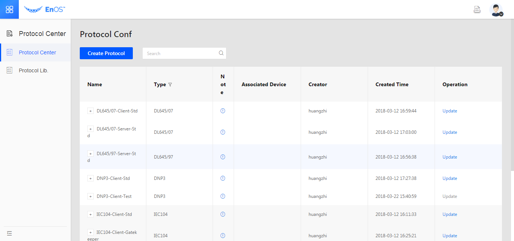

Protocol development
=======================

Communiation protocol overview
--------------------------------

Communication protocol, is a common phrase used in energy industry. The EnOS™
platform provides a rich protocol library that contains common protocols of
energy and power industry, such as modbus, IEC104, OPCDA, OPCUA, and OPC-XML-DA.
In addition, EnOS™ supports conventions for the major device manufacturers in the industry.

With these conventions made available by the platform, you can browse and select
desired conventions in the device template, which can be used after simple
configuration, avoiding development or integration of protocols.

.. toctree::
   :maxdepth: 1
   :caption: Learn

   deviceconnection_protocols
   create_protocol
   managing_protocol
