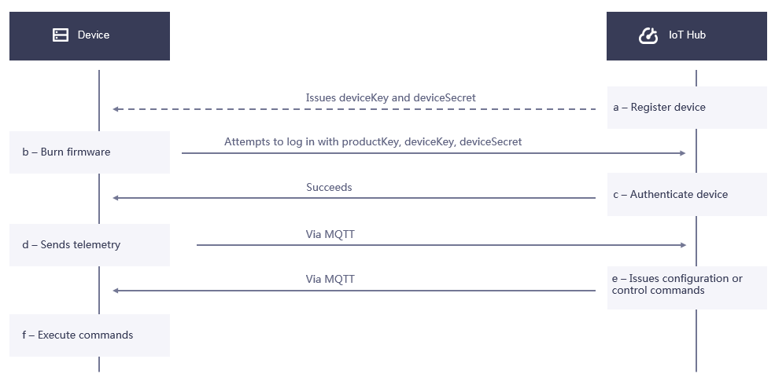

# 基于密钥的单向认证

基于密钥的认证具体是指基于设备三元组，即`ProductKey`、`DeviceKey`和`DeviceSecret`，对设备进行鉴权。

## 概念

设备与EnOS IoT Hub连接主要涉及以下操作及状态：

- **注册**（Registeration）
  就是在云端创建一个设备，可以通过基于web的EnOS控制台界面创建，也可以通过调用REST API的方式创建。

- **登录** （Login）
  设备上送数据之前，必须首先登录成功，然后才可以发送数据。设备登录需要使用设备三元组鉴权。

- **激活** （Activation）
  设备的第一次登录成功，会激活设备，将设备从**未激活**状态，更新为**已激活**状态。**已激活**状态包含**在线**和**离线**两个子状态，在EnOS控制台中会使用**在线**和**离线**两个子状态来代替显示**已激活**状态。

## 设备激活方式和设备状态

在EnOS平台初次创建的设备，默认是处于启用但未激活的状态，等待设备激活。设备激活分为_动态激活_和_静态激活_。
- **动态激活** 的过程如下：

  1. 设备第一次尝试连接时携带`ProductKey`，`ProductSecret`，`DeviceKey`来请求激活，鉴权通过以后，返回`DeviceSecret`给设备。
  2. 设备通过`ProductKey`，`DeviceKey`，`DeviceSecret`尝试登录。
  3. 设备登录成功以后，设备状态从 **未激活** 变成 **在线** 状态。此时设备可以上送数据，如果一段时间内不上送数据，设备状态变成 **离线**。

  如需采用动态激活方式，你需要在Product配置中开启**动态激活**。详细信息，参考[开启动态激活](cloud/managing_products)。

- **静态激活** 的过程如下：

  1. 设备登录请求携带`ProductKey`，`DeviceKey`，`DeviceSecret`。
  2. 设备登录成功以后，设备状态从 **未激活** 变成 **在线** 状态。此时设备可以上送数据，如果一段时间内不上送数据，设备状态变成 **离线**。

如果发现设备异常，或者不希望接受该设备的数据，可以认为将其置为 **禁用**，此时设备将自动下线，处于 **离线** 状态。

设备整体的状态可以分为操作状态（Operational state）、激活状态（Activation state）、连接状态（communication state）三个维度，如下表所示：

<table>
   <tr>
     <th>操作状态</th>
     <th>激活状态</th>
     <th>连接状态</th>
   </tr>
   <tr>
     <td>禁用 Disable</td>
     <td></td>
     <td>离线 Offline</td>
   </tr>
   <tr>
     <td>启用 Enable</td>
     <td>未激活 Inactivated</td>
     <td></td>
   </tr>
   <tr>
     <td></td>
     <td>已激活 Activated</td>
     <td>在线 Online</td>
   </tr>
   <tr>
     <td></td>
     <td></td>
     <td>离线 Offline</td>
   </tr>
</table>

## 认证过程

设备连接主要认证过程如下：
- a. 云端预注册设备
- b. 在edge端配置云端注册的设备信息，主要烧录设备三元组
- c. edge上电、联网，尝试登录。云端验证设备三元组
  - 成功：返回成功，告知设备发送数据
  - 失败：返回失败，中断连接
- d. 设备以MQTT协议发送数据
- e. 云端以MQTT协议下发命令
- f. 设备端响应云端请求

具体流程图如下：

